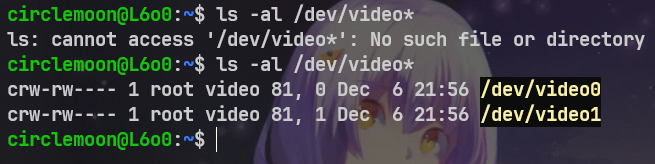
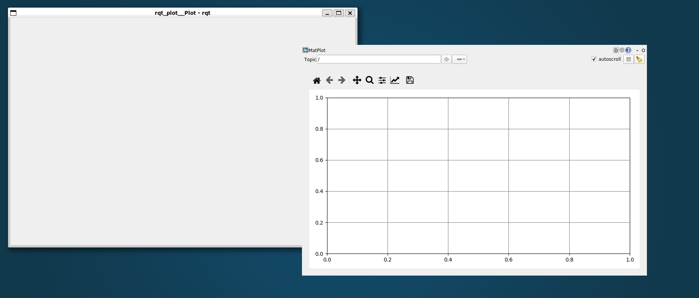

# WSL 配置文档总结
Author： @[skyswordx](https://github.com/skyswordx)

Revise: @[treeofwind](https://github.com/treeofwind)@[silence-breaker](https://github.com/silence-breaker)


## WSL 简介和安装

目前只要是 windows 10 或者 11 以上，都支持 WSL (Windows Subsystem Linux) 的形式来构建 Linux 环境

使用 WSL 的好处就是可以在一个系统下面最大化地利用到硬件的性能，比起虚拟机来说，WSL 的性能会更好一些。

主要参考微软官方文档的链接进行安装：[安装 WSL | Microsoft Learn](https://learn.microsoft.com/zh-cn/windows/wsl/install)


注意：如果直接使用图片中的命令，会默认安装最新版本的 ubuntu 作为发行版，但是我们考核基于的是 ubuntu 20.04，所以在安装时要指定版本号，否则会默认安装最新的发行版，这样就安装不了 ROS1

```shell
wsl --install -d Ubuntu-20.04
```


在安装时建议参考上述的微软文档进行操作，因为现在的 WSL 版本已经升级到了 2，而 WSL 2 的安装方式和 WSL 1 有所不同，是在终端中运行十分简单的命令就可以开启

**并且网上的教程大部分已经过时了，如果按照他们的教程在安装中卡住的话，会导致微软文档的一键安装也无法成功，所以请第一次操作时务必参考微软文档进行操作**

##  WSL 进阶：让 Windows 主系统的 USB 摄像头可以连接并识别到 WSL 子系统中


### 0. 前言和参考链接

**注意，这里实践的难度会比较大，请谨慎分配时间
这里也不是考核必须的内容，只是提供给想在WSL中使用主机USB设备比如USB摄像头的同学一种我们摸索出来的解决方案**

放在这里主要是面向视觉组选择使用 WSL 作为 Linux 环境的同学，但其实考核的内容也不一定会涉及到连接主机摄像头

因为微软的 Linux 内核是被裁剪过的内核，这个内核其实并没有编译 USB 摄像头驱动
导致 WSL 2 的系统无法认识 USB 摄像头这个设备

但是原生的 Linux 系统是可以识别 USB 摄像头的，所以我们可以通过进入 WSL 内核的编译选项进行更改，然后重新编译一个有摄像头驱动版本的 WSL 的内核来解决这个问题

一旦 WSL 有了摄像头驱动以后，就可以通过 usbip 这个工具进行 ip 映射来让 WSL 子系统连接并识别主机的 USB 摄像头了（没重新编译之前是可以连接，但无法认识和使用设备）


[推荐的油管编辑menuconfig的教程，可以跟着视频教程手把手配置](https://www.youtube.com/watch?v=t_YnACEPmrM)
- [github上关于WSL调用摄像头的 issue 其中有人安利了这个链接，可以参考楼中的回复](https://github.com/microsoft/WSL/issues/6211)

如果油管的教程因为网络原因无法观看，可以参考下面的参考链接。**但是准确度和教程完整性以及有效性不敢保证**

我在尝试时也是跟看完油管教程操作之后才成功编译好的，之前只参考下面链接也是编译失败的，下面的链接可以对比着看看，熟悉其中的配置项和流程之类的

- [参考0:修改WSL2内核以支持实时调度和UVC摄像头](https://zhuanlan.zhihu.com/p/509248038)

- [参考1:如何让WSL2使用自己编译的内核](https://zhuanlan.zhihu.com/p/324530180)

- [参考2:WSL2编译内核并更改替换内核版本](https://blog.csdn.net/qq_45698138/article/details/134655673)


可以考虑使用命令行 make 命令配合修改 config 文件编译，或许会好一点

### 1. 确认要下载的内核版本和 config 配置文件版本

注意要先确认 [WSL 的内核版本](https://github.com/microsoft/WSL2-Linux-Kernel/releases) 和 [config配置文件版本，一般在Microsoft文件夹里有指路](https://github.com/microsoft/WSL2-Linux-Kernel/blob/linux-msft-wsl-5.15.y/arch/x86/configs/config-wsl)，注意要相匹配，最好都要从 github 上面下载


我尝试过版本 5.15.137.3 的内核版本配 5.15.137.1 的配置文件，可以完成下面的操作

也试过 5.10.10 x 的内核版本配相应的配置文件，但卡住在 `menuconfig` 中找不到 `media usb adapter` 这一项

### 2. 下载 WSL 2 内核

这一步要在 WSL 2 中新建一个专用的文件夹，并进入
把 WSL 2 内核源码仓库搞到这个文件夹里面
```shell
>> mkdir ~/kernel
>> cd ~/kernel
在这个kernel文件夹放内核源码仓库
```

option 1:
要是相信自己网速的话就直接 git 克隆官方 github 仓库
```shell
>> VERSION=5.15.137.3
>> sudo git clone -b linux-msft-wsl-${VERSION} https://github.com/microsoft/WSL2-Linux-Kernel.git ${VERSION}-microsoft-standard && cd ${VERSION}-microsoft-standard
```


option 2:
建议在官网**下载 tar 压缩包**并在 WSL 这里解压
>>因为 7z 和 zip 压缩格式本身都不能保留 unix 风格的文件权限，比如解压出个可执行文件要重新 chmod chown 才能恢复正常。而 tar 格式就是 unix 平台特有的格式。而 tar 本身不提供压缩，无非就是把包括所有文件的内容和权限拼成一个文件而己

如果下载 zip 压缩包，**并且在 windows 系统下解压**，**然后才复制进去 WSL 会有下面问题**
- 会出现权限错误，你在编译内核的时候可能需要 n 条 `chmod 777` 命令
- 并且里面解压出来会莫名其妙地注释掉一些重要语句，甚至会出现乱码，导致编译内核出现错误
>>**之后的 zip 压缩包，也应该要把 zip 压缩包放在 WSL 里面解压，不要在 windows 系统下解压再复制进去，或者在 windows 的文件资源管理器(explorer.exe)的界面，使用 windows 系统的工具进行解压**


如果因为一些爱国 buff 没办法在 `github` 上下载 `tar.gz`，这里有一个小贴士
双击下载后，在 `edge` 浏览器下载处复制下载链接，然后在linux终端用 `wget` 语句下载

### 3. 下载内核的配置文件

.config 配置文件是用于指导 make 编译的，这一步要在内核仓库里面搞一个配置文件

option 1
在内核仓库里面创建一个. config 文件，内容来自官方 github 仓库的参考文件
```shell
>> touch .config # 创建一个空的配置文件
# 接着打开这个文件，然后把官方的配置文件内容复制进去
>> sudo vim .config # 用 vim 打开
>> code .config # 用 vscode 打开
>> geddit .config # 用 gedit 打开
# 然后把官方的配置文件内容复制进去
>> ctrl +v
```

option 2
要是自己原来的内核版本看起来大概符合要求（比如知识大于 5.10. x）可以在直接选择自己内核版本的源码仓库，相应的配置文件可以从本机获取
```shell
>> sudo cp /proc/config.gz config.gz
>> sudo gunzip config.gz
>> sudo mv config .config
```

### 4. 实时内核补丁安装

再下载相应的实时 RT_PREEMPT 补丁，记住一定要和内核版本号匹配，[补丁下载链接](https://www.kernel.org/pub/linux/kernel/projects/rt/)

回到内核仓库文件夹的上一级文件夹（也就是 kernel 文件夹），把 RT_PREEMPT 补丁解压到内核文件夹
```shell
>> cd ~/kernel/
>> gunzip patch-xxx.patch.gz
```

进入内核仓库文件夹，安装补丁，注意 `patch` 文件不要选 `.xz` 结尾的，用 `xz` 会与源码文件冲突，是没法直接补丁的
```shell
>> cd ~/kernel/内核仓库文件夹
>> patch -p1 < ../patch.xxx(具体的名字看你补丁解压之后的名字)
```

### 5. 编辑 config 文件

在内核仓库文件夹输入 `sudo make menuconfig` 命令，进入下图页面，更改下面选项

```
Build WSL2 kernel with usb camera support
menuconfig -> Device Drivers -> Multimedia support -> Filter media drivers
           -> Device Drivers -> Multimedia support -> Media device types -> Cameras and video grabbers
           -> Device Drivers -> Multimedia support -> Video4Linux options -> V4L2 sub-device userspace API
           -> Device Drivers -> Multimedia support -> Media drivers -> Media USB Adapters   -> USB Video Class (UVC)
           -> Device Drivers -> Multimedia support -> Media drivers -> Media USB Adapters   -> UVC input events device support
           -> Device Drivers -> Multimedia support -> Media drivers -> Media USB Adapters   -> GSPCA based webcams
```

之后再按 `/` 去查看搜索 `UVC`，查看相应的 `[n]` 是否都变成 `[y]`，注意看相应的项以及它的 `location`，应该是还要再改一个叫做 `usb gabget through...` 之类的东西
这样 UVC 驱动应该就可以被编译进内核了

注意，在 `menuconfig` 文件输入 `/UVC` 进行搜索后无法直接在上面更改，需要看它的提示，一个个去到具体文件处手动更改

然后是选择编译实时补丁
```
# Enable CONFIG_PREEMPT_RT  
-> General Setup  
-> Preemption Model (Fully Preemptible Kernel (Real-Time))  
(X) Fully Preemptible Kernel (Real-Time)


# Enable CONFIG_HIGH_RES_TIMERS 
-> General setup  
-> Timers subsystem  
[*] High Resolution Timer Support


# Enable CONFIG_NO_HZ_FULL  
-> General setup  
-> Timers subsystem  
-> Timer tick handling (Full dynticks system (tickless))  
(X) Full dynticks system (tickless)


# Set CONFIG_HZ_1000 (note: this is no longer in the General Setup menu, go back twice)  
-> Processor type and features  
-> Timer frequency (1000 HZ)  
(X) 1000 HZ


# Set CPU_FREQ_DEFAULT_GOV_PERFORMANCE [=y] 
-> Power management and ACPI options  
-> CPU Frequency scaling  
-> CPU Frequency scaling (CPU_FREQ [=y])  
-> Default CPUFreq governor (<choice> [=y])  
(X) performance
```

### 6. 准备编译

至此，内核就已经配置成功了

如果想要修改内核版本号，可以修改 Makefile 文件
```shell
>> sudo vim Makefile
```

如果想修改内核名，可以修改. config 文件
```shell
>> sudo vim .config
```


然后再安装 Linux 内核编译工具
```shell
>> sudo apt upgrade
>> sudo apt update
>> sudo apt-get build-dep linux
>> sudo apt-get install libncurses-dev flex bison openssl libssl-dev dkms libelf-dev libudev-dev libpci-dev libiberty-dev autoconf fakeroot

```


编译模块，这里的 -j 4 是指用几个 CPU 核心编译，我只给 WSL 2 分配了 4 个核，所以这里选 4
```shell
>> sudo make modules -j4
```

安装模块
```shell
>> sudo make modules_install
```

查看是否安装成功
```shell
tree /lib/modules
```

最后编译内核
```shell
sudo make -j4
```


### 7. 更换启动内核

我们只要在 `内核仓库/arch/x86/boot/` 的 bzImage 内核镜像文件就够了，把她保管好

然后复制到一个你喜欢的地方，然后再复制一份 `C:\windows\system32\lxss\tools\` 这个文件夹里面

之后在 `C:\用户(user)\你的用户名\` 这个文件夹里面新建一个. wslconfig 文件
再在里面指定 WSL 2 的启动内核
```
[wsl2]
kernel=C:\\Windows\\System32\\lxss\\tools\\bzImage
```

之后进入 powershell，重新启动 WSL 即可，可以在 WSL 里面用 `uname -r` 或者 `neofetch` 检查
```powershell
>> wsl --shutdown
>> wsl
```

验证是否更换内核成功
```shell
uname -r
```
如果这个时候显示的是你自己编译时指定的内核名，那么就说明你成功更换启动内核了


### 8. 使用 USBIP 来连接主机 USB 设备

windows 端和 WSL_linux 端的配置参考[微软官方教程](https://learn.microsoft.com/en-us/windows/wsl/connect-usb)就够了

首先按照文档中的描述，先使用
```shell
usbip list -l
```
获取你要连接的 USB 设备的 ID，然后使用
```shell
usbip attach -r <remote_host> -b <busid>
```
来连接设备

再连接完你的 USB 摄像头之后，在 WSL 端可以进行下面的验证
```shell
lsusb
```
如果显示摄像头信息则成功了一半

接着使用 `ls -al /dev/video*` 来查看摄像头设备，如果有设备则说明摄像头已经被识别了
如下图所示


第一次识别不了是因为主机的摄像头没有用 `usbip` 工具映射到 WSL 中，所以 WSL 无法识别到摄像头设备

### 9.整点骚活

如果想在终端中用一种比较好看的方式来查看系统信息的话使用 `neofetch`
```shell
sudo apt update
sudo apt install neofetch
```


恭喜你，你已经成功地让 WSL 2 识别到了主机的 USB 摄像头，可以狠狠纪念一下啦


## 使用 WSL 部署 GPU 版本的 yolo 的注意事项

### 使用 GPU 加速的 yolo 部署准备

注意，如果你使用的是**最新版本的 WSL 版本的话**，就暂时不需要在WSL中重新安装cuda toolkit和cuDNN 就可以使用 pytorch 的硬件加速，你只需要确保在 Windows 中安装即可**。这里具体的情况参考 Nvidia 官方文档 [CUDA on WSL](https://docs.nvidia.com/cuda/wsl-user-guide/index.html)
- 最新版本的 WSL 如果在 WSL 中安装不匹配的 cuda-toolkit 反而会引发不必要的冲突问题


WSL目前的大版本是 WSL2，在大版本内更新 WSL 小版本的命令如下
```bash
wsl --update
```
更多命令参考 [WSL 的基本命令 | Microsoft Learn](https://learn.microsoft.com/zh-cn/windows/wsl/basic-commands)


在 windows 主机端配置好 CUDA 驱动后，可以在 WSL 终端中使用下面的命令进行硬件映射检测
```bash
>> nvidia-smi
```
正常的话结果应该是这样的
```bash
Mon Dec  2 16:47:41 2024
+-----------------------------------------------------------------------------------------+
| NVIDIA-SMI 560.35.02              Driver Version: 560.94         CUDA Version: 12.6     |
|-----------------------------------------+------------------------+----------------------+
| GPU  Name                 Persistence-M | Bus-Id          Disp.A | Volatile Uncorr. ECC |
| Fan  Temp   Perf          Pwr:Usage/Cap |           Memory-Usage | GPU-Util  Compute M. |
|                                         |                        |               MIG M. |
|=========================================+========================+======================|
| 0  NVIDIA GeForce RTX 5090 Ti Super On  |   00000000:01:00.0  On |                  N/A |
|  0%   30C    P8              5W /  165W |     870MiB /  16380MiB |      2%      Default |
|                                         |                        |                  N/A |
+-----------------------------------------+------------------------+----------------------+

+-----------------------------------------------------------------------------------------+
| Processes:                                                                              |
|  GPU   GI   CI        PID   Type   Process name                              GPU Memory |
|        ID   ID                                                               Usage      |
|=========================================================================================|
|    0   N/A  N/A       722      G   /Xwayland                                   N/A      |
```
并且可以使用这个指令来查看WSL的图形化窗口是否是由主机的显卡渲染的
```bash
>> glxinfo | grep "OpenGL"
```
如果一切正常的话，应该显示的是主机中显卡的信息
```bash
OpenGL vendor string: Microsoft Corporation
OpenGL renderer string: D3D12 (NVIDIA GeForce RTX 5090 Ti Super)
OpenGL core profile version string: 3.3 (Core Profile) Mesa 21.2.6
OpenGL core profile shading language version string: 3.30
OpenGL core profile context flags: (none)
OpenGL core profile profile mask: core profile
```


## 使用 WSL 主机连接摄像头会有点卡

## 在 WSL 中使用 ROS1 的 rqt 图形化调试窗口注意事项

有时候在运行 `rqt` 相关命令的时候，显示的窗口框框和内容会发生错位，比如下面的例子

这个时候无论鼠标怎么点击或者拖动内容都没有响应，这时候其实是该 `rqt` 命令的缓存爆了

清除缓存即可
```
>> rqt_plot --clear-config
```

这里的例子是使用 `rqt_plot`，对于其他的 `rqt` 命令也是一样的，只要在命令后面加上 `--clear-config` 就可以清除缓存