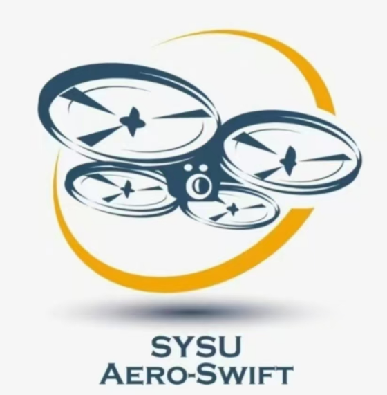

# SYSU AERO-SWIFT 2024 秋季考核

  

**欢迎来到中大空中机器人队 2024 秋季考核任务。下面是一些关于考核和工程的相关说明。**

## 考核仓库指南

### 考核须知

[考核须知](./doc/考核须知.md) 该部分将介绍考核所有的注意事项

### 补充知识
+ [基础知识和概念](./doc/基础知识和概念.md) 这部分介绍一些基础知识和概念，有助于快速了解和上手任务。
+ [环境配置与准备](./doc/环境配置与准备.md) 这部分会介绍如何配置基本的考核环境，着重于虚拟机的安装，Linux操作系统的配置，属于考核最基本环境的搭建
+ [基于git和GitHub完成考核任务](./doc/基于git和GitHub完成考核任务.md) 该部分会介绍如何基于git和GITHUB获取考核仓库及如何提交每周的任务成果
+ [基本的Markdown语法](./doc/基本的Markdown语法.md) 该部分简要介绍markdown语法，帮助大家撰写报告。
+ [团队协作的规范和代码风格养成](./doc/团队协同的规范.md) 该部分会规定代码与文件规范
+ [Linux基础知识](./doc/Linux基础知识.md) 该部分介绍Linux基础知识，帮助大家快速上手Linux。
+ [Linux下编辑文本的工具](./doc/Linux下编辑文本的工具.md) 该部分介绍一下Linux下的文本编辑工具。
+ [Shell教程](./doc/Shell教程.md) 该部分介绍一下shell
+ [飞控：基于ROS完成考核](./doc/飞控：基于ROS完成考核.md) 该部分将介绍如何完成飞行控制相关部分的考核
+ [基于Opencv完成考核](./doc/视觉：基于OpenCV完成考核.md)该部分将介绍如何完成视觉相关部分的考核

### 更多参考
[参考资料](./doc/参考资料.md)会给出学长们平时写的总结，或认为比较好的参考博客链接

## 版本说明

目前版本：**v8.0.0**

如果任务发生变更或者修改都会在这里说明，请留意此处**强调更改**的版本更新。

| 版本       | 更新内容                                                     |
| ---------- | ------------------------------------------------------------ |
| v1.0.0     | (2018) 发布了前三周的任务。                                  |
| v1.1.0     | 发布了后四周的分流任务以及挑战任务，修改了 v1.0 的部分作业要求。 |
| v1.2.0     | 分流任务做了相应修改，其中策略组部分新增任务：提交"如何应用深度学习到比赛策略的报告"。 |
| v2.0.0     | 整改为任务八相关的考核。重新制定考核架构，公布基础考核题目。 |
| v2.1.0     | 发布了后四周的项目考核。                                     |
| v3.0.0     | (2019) 面向新的技术路线和 Mission 9 出的新的题目。           |
| v3.1.0     | 发布了前三周的任务，修改了 v3.0.0 的部分要求。               |
| v3.2.0     | 修改了第二周背景还原任务的要求和评分标准。|
| v3.3.0     | 发布后三周的项目考核题目。                                   |
| v4.0.0     | (2020) 面向Mission 9发布2020-2021年招新题目                  |
| v5.0.0 | (2021) 面向Mission 9发布2021年招新题目                   |
|v6.0.0|(2022)面向Mission 9现阶段工作发布2022招新题目|
|v7.0.0|(2023)面向Mission 9现阶段工作发布2023招新题目|
|v8.0.0|**(2024)面向Mission 10发布2024年招新题**|

aaaaaaaaaaaaaaaaaaaaa
## 版权声明

**本仓库所有资料及其附件归中大空中机器人团队所有，禁止外泄资料！**
