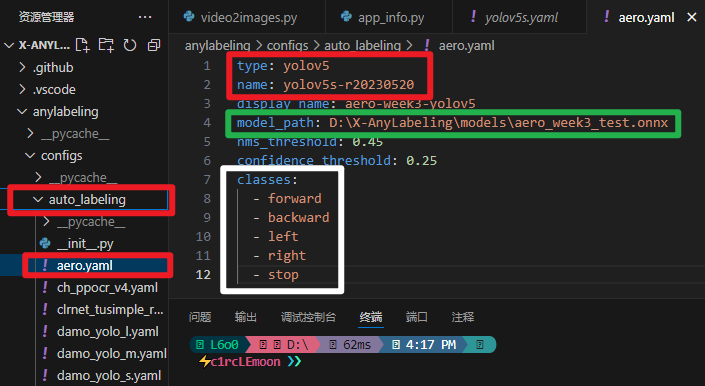

# 欢迎来到视觉项目指南！

Author：@[liangbm3](https://github.com/liangbm3)

Revise:  @[skyswordx](https://github.com/skyswordx)

## 配置yolov5
在上周的任务中，有一个任务是在 Anaconda 的一个虚拟环境内部署 yolov5。相信大家已经部署好了yolov5环境。如果没有完成的话，可以参考一下命令快速完成部署，以完成本周任务。


### 部署cpu版本
这个非常简单，进入你创建的conda环境，依次执行以下命令即可：
```bash
git clone https://github.com/ultralytics/yolov5  # clone repository
cd yolov5
pip install -r requirements.txt  # install dependencies
```

### 部署GPU版本

注意，如果你使用的是 WSL 版本的话，**不需要在WSL中重新安装cuda toolkit和cuDNN 就可以使用 pytorch 的硬件加速，你只需要确保在 Windows 中安装即可**。具体参考 Nvidia 官方文档 [CUDA on WSL](https://docs.nvidia.com/cuda/wsl-user-guide/index.html)
- 如果安装了反而会引发不必要的冲突问题


**这个的前提是你的电脑拥有NVidia显卡！！！**
在VMware中，虚拟机一般是无法直接调用实体机的显卡的。所以只能使用WSL和双系统。或者还有一个方案是在Windows和在VMware中同时部署，在Window中完成训练，在VMware的虚拟机中完成推理。

为了扫除下面的阅读障碍，这里简单介绍一下几个概念：
+ **GPU（显卡）**：显卡是我们平时说的GPU，现在大多数的电脑使用NVIDIA公司生产的显卡
+ **CUDA Driver**：这个是我们常说的显卡驱动，操作系统需要安装对应的显卡驱动才能使用显卡。
+ **CUDA**：CUDA是一种由NVIDIA推出的通用并行计算架构，该架构使GPU能够解决复杂的计算问题
+ **CUDA Toolkit**：CUDA工具包的主要包含了CUDA-C和CUDA-C++编译器、一些科学库和实用程序库、CUDA和library API的代码示例、和一些CUDA开发工具。（通常在安装CUDA Toolkit的时候会默认安装CUDA Driver；但是我们经常只安装CUDA Driver，没有安装CUDA Toolkit，因为有时不一定用到CUDA Toolkit；比如我们的笔记本电脑，安装个CUDA Driver就可正常看视频、办公和玩游戏了）
+ **NVCC**：其实就是CUDA的编译器,可以从CUDA Toolkit的/bin目录中获取,类似于gcc就是c语言的编译器
+ **CUDNN**： 是用于深度神经网络的GPU加速库；它强调性能、易用性和低内存开销。可以集成到高级别的机器学习框架中，如谷歌的Tensorflow、加州大学伯克利分校的流行caffe软件。

如果你使用的是双系统，会比使用WSL多一步，那就是安装显卡驱动，一般在双系统安装教程中有所涉及。从安装CUDA这一步开始，WSL和双系统的步骤有细微差别，整体步骤如下：
+ 安装CUDA，自行搜索教程
+ 安装CUDNN，自行搜索教程
+ 如果输入`nvcc -V`能够打印出CUDA版本说明CUDA安装成功
+ 创建conda虚拟环境，在环境中安装pytorch，在[这里](https://pytorch.org/get-started/locally/)选择合适的版本，参考如图
  
    然后复制命令运行  
    *！！注意：CUDA版本不能大于显卡驱动所能支持的最大版本（可以使用`nvidia-smi`命令查看）*
+ 验证安装，可以使用以下代码进行检验

    ```python
    import torch
    print(torch.cuda.is_available())
    ```
+ 然后安装其他依赖包即可

    ```bash
    git clone https://github.com/ultralytics/yolov5  # clone repository
    cd yolov5
    pip install -r requirements.txt  # install dependencies
    ```
*Tips:如果pip下载缓慢可以换源，上网自行搜索教程*

## 深度学习基本概念介绍

### 关于数据集
每个数据集由一个个样本组成，它们一般遵循独立同分布。通常每个样本由数据实例（可以理解为图片）和标签（可以理解为类别）组成。

数据集一般分为三种：
+ 训练集 (Training Set)：训练集是用来训练模型的数据集。模型通过学习训练集中的样本，逐步调整参数，优化模型的预测能力。
+ 验证集 (Validation Set)：验证集用于在训练过程中评估模型的性能，并用来调整模型的超参数（如学习率、正则化强度、网络层数等）。它与训练集是分开的，但又是模型在训练时能访问的。
+ 测试集 (Test Set)：测试集用于在模型训练和验证完全结束后评估模型的最终性能。它是模型在训练过程中没有见过的数据，用于模拟模型在实际应用中的表现。

### 进行本项目要了解的一些概念
+ 学习率（Learning Rate）：学习率是优化算法中的超参数，决定了模型在每次参数更新时的步长。学习率过大可能导致训练不稳定，学习率过小则可能导致收敛速度过慢。
+ 批量大小（Batch Size）：批量大小是指每次迭代时用于计算梯度的训练样本数。
+ Epoch：Epoch 是指在训练过程中，整个训练数据集经过神经网络一次完整的前向传播和反向传播过程。在一个 epoch 中，神经网络会从训练数据中获取信息，计算损失并更新模型的权重。通常，训练过程会包括多个 epoch，直到模型在验证集上的性能达到预期为止。如果训练 epoch 数量过多，可能会导致模型过拟合训练数据，即在训练集上表现良好，但在新数据（验证集或测试集）上表现不佳。
+ 权重（Weights）：权重是神经网络中的可训练参数，它们决定了神经元之间的连接强度。每个神经元与前一层神经元之间的连接都会有一个权重，权重值的大小影响了输入信号的传递强度。神经网络通过这些权重来调整输出结果，使得输出更接近实际目标。

**其他概念自行阅读其他资料。深度学习是一门很深的学问，这个项目只是让大家对其有一个初步的体会，无需深究。**

## 标注工具的使用

### 标注的作用

深度学习的数据集是需要我们事先准备好的，人工智能有多少智能，就要有多少人工。准备数据集的过程大概就是标注。

### 使用经典标注工具 labelimg

#### 安装
使用以下命令进行安装：
```bash
pip install labelimg -i https://pypi.tuna.tsinghua.edu.cn/simple
```
#### 使用

在命令行输入以下命令
```bash
labelImg
```
界面如下：


把标注格式改为yolo即可

更加具体的使用可以参考<https://blog.csdn.net/StopAndGoyyy/article/details/139906637>

### 使用 x-anylabeling

上面的标注工具是经典的手动标注工具，这里有一种新的思路，就是先使用手动标注的数据集做个小模型，然后写个脚本用小数据集的模型来代替你去识别图片
- 如果能认出来的话就用识别结果导出成标注的文件
- 认不出来的自动另存，再手动标注一下然后重新训练（太多认不出来的，可以取部分来标注），训练出来的模型再跑新的图片，重复做几次就完善了
- 这样就可以大大减少人工标注的工作量

这里的 x-anylabeling 就实现了上述的一部分功能，可以导入训练好的模型进行自动标注
当然，这个标注工具也像 labelimg 一样支持手动标注


下是这个项目的 github地址
- [X-AnyLabeling/docs/zh_cn/get_started.md at main · CVHub520/X-AnyLabeling](https://github.com/CVHub520/X-AnyLabeling/blob/main/docs/zh_cn/get_started.md)
- [X-AnyLabeling/docs/zh_cn/user_guide.md at main · CVHub520/X-AnyLabeling](https://github.com/CVHub520/X-AnyLabeling/blob/main/docs/zh_cn/user_guide.md)
- 注意，直接安装二进制文件印象中好像只支持默认的人工标注功能，要想有导入模型进行自动化标注，需要克隆源码进行编译
- 编译时也有 GPU 加速的版本和只使用 CPU 的版本，按需下载安装二进制文件或者编译即可

#### 配置自动标注

首先参考文档克隆源码并且配置好环境之后，找到红框的 `auto_labeling` 文件夹，然后在这里面复制一份 `yolov5s.yaml` 的配置文件作为蓝图，保留其中 `type` 和 `names` 两个字段，然后修改其中的 `model_path` 为你自己的模型路径



然后模仿 `yolov5s.yaml` 的配置文件把 `classes` 字段改为和你自己的设置类别种类一致即可

注意这里使用的模型权重文件只能使用 `onnx` 格式的，所以需要将 `yolov5` 的 `pt` 权重文件转换为 ` onnx ` 格式

转换的方法也是很简单，在 `yolov5` 的文件夹下面有一个 `export.py` 文件，要运行它首先要安装好 `onnx` 和 `onnx_runtime` 这两个包

**注意**，这两个包可以选择 CPU 版本的，也可以选择 GPU 版本的，并且使用 CUDA GPU 的话还有版本匹配问题，具体参见官方文档
-  [ONNX -Ultralytics YOLO 文档](https://docs.ultralytics.com/zh/integrations/onnx/#usage)
-  [Compatibility | onnxruntime](https://onnxruntime.ai/docs/reference/compatibility.html)

在安装好环境之后以 ` python export. py  --include torchscript onnx` 运行这个文件就可以将 `pt` 文件转换为 `torchscript` 文件和 `onnx` 文件

**注意**，在以后的模型训练中，**最好可以修改 `train.py` 把保存的模型结果改为直接保存模型参数 ` state dicts`**，尽量不要保存整个模型，否则在二次加载模型会出现下面的 issue
- [ModuleNotFoundError: No module named 'models' · Issue #18325 · pytorch/pytorch](https://github.com/pytorch/pytorch/issues/18325) 
- [torch.load() requires model module in the same folder · Issue #3678 · pytorch/pytorch](https://github.com/pytorch/pytorch/issues/3678)

视频教程
- [【YOLO】X-AnyLabeling自动标注工具,AI帮你解放双手_哔哩哔哩_bilibili](https://www.bilibili.com/video/BV12c46eUE4o/?spm_id_from=333.337.search-card.all.click&vd_source=9c85d181a345808c304a6fa2780bb4da)

> Tips:本次给出的数据集使用labelImg标注，如果使用x-anylabeling可能要自己编写脚本对label格式进行转换。

## 数据集的预处理
+ 不同的数据集的格式不同的，在训练之前，我们通常要转换成模型能够理解成的格式。例如在使用X-AnyLabeling标注工具标注完成后，可能得到的数据集是json格式存储的，我们需要将其转换为txt格式，才能使用模型进行训练。
+ 在训练之前，我们通常要将数据集打乱，然后划分为训练集、验证集和测试集，然后使用模型训练。
+ 图片数据的预处理还包括图像尺寸调整 (Resizing)，归一化 (Normalization)，数据增强 (Data Augmentation)，均值和标准差归一化 (Mean Subtraction and Standardization)， 灰度转换 (Grayscale Conversion)，去噪 (Denoising)，图像平滑 (Smoothing)等操作。

> Tips：将数据集划分为训练集、验证集和测试集的脚本已经给出，在实际操作时可以编写其他脚本对数据集进行预处理。

## 数据集的训练

将数据集`dataset.zip`解压，放在你部署的yolov5的根目录里面。数据集`dataset`的组成：
+ images:图片
+ labels:图片对应的标签

标签格式如下：
```
<class_id> <x_center> <y_center> <width> <height>
```
+ class_id: 目标的类别ID，从0开始计数。每个类别对应一个整数索引。
+ x_center: 目标边界框中心点的 x 坐标，归一化到[0, 1]范围，即相对于图像的宽度。
+ y_center: 目标边界框中心点的 y 坐标，归一化到[0, 1]范围，即相对于图像的高度。
+ width: 目标边界框的宽度，归一化到[0, 1]范围，即相对于图像的宽度。
+ height: 目标边界框的高度，归一化到[0, 1]范围，即相对于图像的高度。

先进入`dataset`目录，运行命令：
```bash
python process_data.py
```
运行这个脚本的目的是把数据集打乱和分割成训练集、验证集和测试集。同时生成images对应的路径。运行后会在`dataset`目录下生成以下文件/文件夹：
+ `test`
+ `train`
+ `val`
+ `train.txt`
+ `val.txt`
+ `test.txt`

然后进入到项目的根目录（即yolo文件夹下）,运行如下命令即可开始训练：
```bash
python train.py --data ./dataset/config.yaml
```
在`train.py`中有许多命令行参数可以配置，如图：


下面对一些比较重要的参数讲解，其他自行翻译或上网查阅：
+ `--weights`：指定初始权重的路径（通常为预训练的模型权重）。默认是 yolov5s.pt，即 YOLOv5 小版本的预训练模型。
+ `--data`：指定数据集配置文件路径（.yaml 文件）。默认是 coco128.yaml，指向一个包含数据集配置（如类名、数据路径等）的 YAML 文件。
+ `--hyp`：指定超参数文件路径（.yaml 文件），例如学习率、批量大小等训练相关的超参数。默认是 hyp.scratch-low.yaml。
+ `--epochs`：训练的总周期数。默认是 50。
+ `--batch-size`：总批量大小（对所有GPU的合并批量），如果是 -1，则使用自动批量。
+ `--imgsz`,` --img`, `--img-size`：指定训练和验证时图像的尺寸（像素）。默认是 640。

如果显卡配置比较低可以把epochs和batch_size调小一点。也可以把图像尺寸调小一点。例如，命令
```bash
python train.py --data ./dataset/config.yaml --epochs 40 --batch-size 16
```
的含义就是使用我们给出的数据集，epochs为40，batch size为16训练模型。  

关于python命令行参数更加具体的使用可以参考这篇博客：<https://liangbm3.top/2024/10/29/python%E5%86%85%E7%BD%AE%E5%BA%93argparse%E7%9A%84%E4%BD%BF%E7%94%A8/>

训练完成后，会打印训练结果，同时在runs文件夹也会有相应结果。

## 使用权重进行推理
训练完成后会得到权重，我们可以使用权重来推理预测新的图片。例如：
```bash
python detect.py --weights ./runs/train/exp6/weights/best.pt  --source ./dataset/test/images/
```
这个命令就是使用训练得到的权重，对测试集文件夹下的所有图片进行推理。推理结果一般在`runs/detect/`文件夹下。

命令

```bash
python detect.py --weights ./runs/train/exp6/weights/best.pt  --source 0
```
会调用电脑摄像头对视频流进行实时推理。

## URDF简介


在 ROS (Robot Operating System) 中，URDF (Unified Robot Description Format) 是一种用于描述机器人模型的 XML 文件格式。它用来定义机器人的各个部分（如关节、连杆、传感器等）的结构和物理属性，以便于机器人在仿真和实际控制中的应用。

URDF 文件通常被用于 ROS 中的 机器人模型描述，并与机器人控制、规划、运动学以及可视化等方面的工具配合使用，尤其是在 RViz 以及 Gazebo 仿真环境中。URDF 文件提供了一个统一的方式来描述机器人硬件的几何形状和结构，允许开发者轻松进行机器人建模和仿真。

### 文件组成

+ Robot  
robot 标签是 URDF 文件的根元素，用来包裹机器人所有的描述信息。每个 URDF 文件描述一个机器人模型，通常是一个单一的 robot 元素。
+ Link  
link 元素表示机器人模型的一个固定部分（如机器人臂的某一部分），是机器人由若干连杆（link）组成的结构。每个 link 元素包含机器人的几何形状、物理属性（如质量、惯性等）以及碰撞检测信息。
+ Joint  
joint 元素定义了机器人各部分之间的连接方式，描述了关节的类型、坐标系和物理属性。
每个 joint 元素通常指示两个 link 之间的运动关系，常见的关节类型有 revolute（转动关节）、prismatic（平移关节）、fixed（固定关节）等。
+ Visual  
visual 元素定义了每个 link 的外观。可以通过指定 .stl、.dae 或 .obj 等 3D 模型文件来表示。
这个部分是为了在仿真或 RViz 中显示机器人外形。
+ Collision  
collision 元素用来描述机器人的碰撞模型。碰撞模型的作用是用于物理仿真中的碰撞检测，它通常比视觉模型简单，主要用于提高计算效率。
+ Inertial  
inertial 元素提供了机器人各部分的惯性信息（如质量、惯性矩阵等）。这些数据对于仿真和运动学计算至关重要。
+ Transmission（可选）  
transmission 元素用于描述关节与动力系统之间的关系（例如电机与关节之间的传动关系）。

### 常见的 URDF 关节类型
+ Revolute（转动关节）  
允许两个链接绕着固定轴转动。
示例：机器人关节，舵机。
+ Prismatic（平移关节）  
允许两个链接沿着一个固定方向滑动。
示例：线性推进器。
+ Fixed（固定关节）  
两个链接之间没有相对运动，它们是固定连接的。
示例：机器人的底盘和机器人臂的连接。
+ Floating  
允许自由度为6的连接，通常用于描述浮动基座。

我们使用URDF搭建了一个小车模型，在`ros_project/src/little_car/urdf`内。