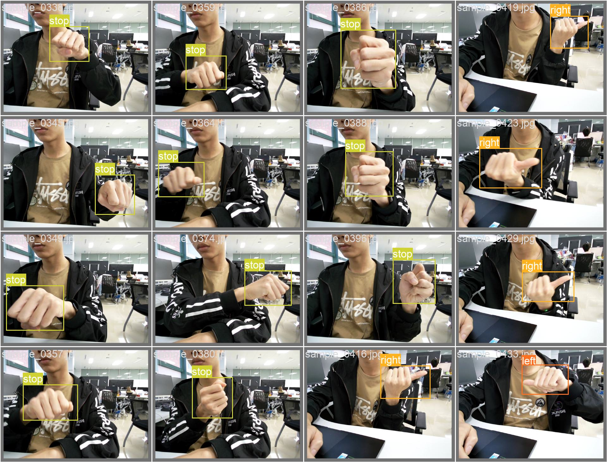

# 视觉组第三周考核任务

Author：@[liangbm3](https://github.com/liangbm3)

Revise:  @[skyswordx](https://github.com/skyswordx)

## 学习目标

+ 学习如何神经网络模型的训练过程
+ 学习制作自己的数据集
+ 学习如何使用手势控制小车/无人机移动

具体内容参加[学习指导](./get_started.md)  
附件文件在`source`文件夹下。
## 本周任务

1. 如果上一周没有完成yolov5环境的部署，请继续完成，并能成功运行`detect.py`
2. 我们给出了一个yolov5的一个训练结果，里面有权重和训练数据，该模型能够对五种不同手势进行分类，如图
    
    
    

    P.S: 看到这里不觉得 bm 学长很帅嘛 ~

    然后请你尝试：
    1. 自己拍摄一些类似的手势，然后使用`detect.py`进行预测，给出预测结果。
    2. 使用电脑摄像头/外置摄像头实时进行预测，给出截图
    **由于该权重是使用我们自己录制的数据集进行训练，且只由一个人录制，数据量较小，可能不具有鲁棒性，所以可能会出现准确度较低的情况**
3. 我们给出了自己录制的数据集，请你使用该数据集自己训练一个权重，给出训练过程。
4. 尝试自己录制个性手势，并用LabelImg标注，然后按照上述流程训练，给出训练过程。
5. 我们给出了一个小车模型和源码，在上述的任务中我们已经在yolov5中能够对手势进行识别，请尝试将手势信息发布在ros的一个话题中，然后小车订阅该话题，从而实现控制。