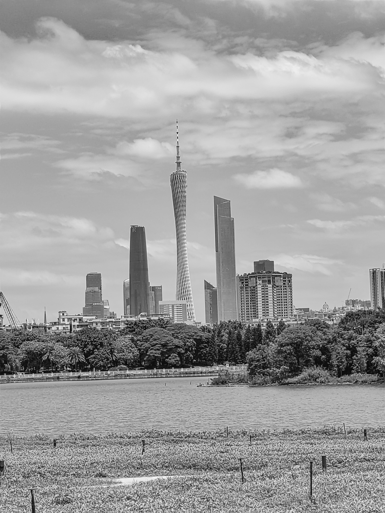
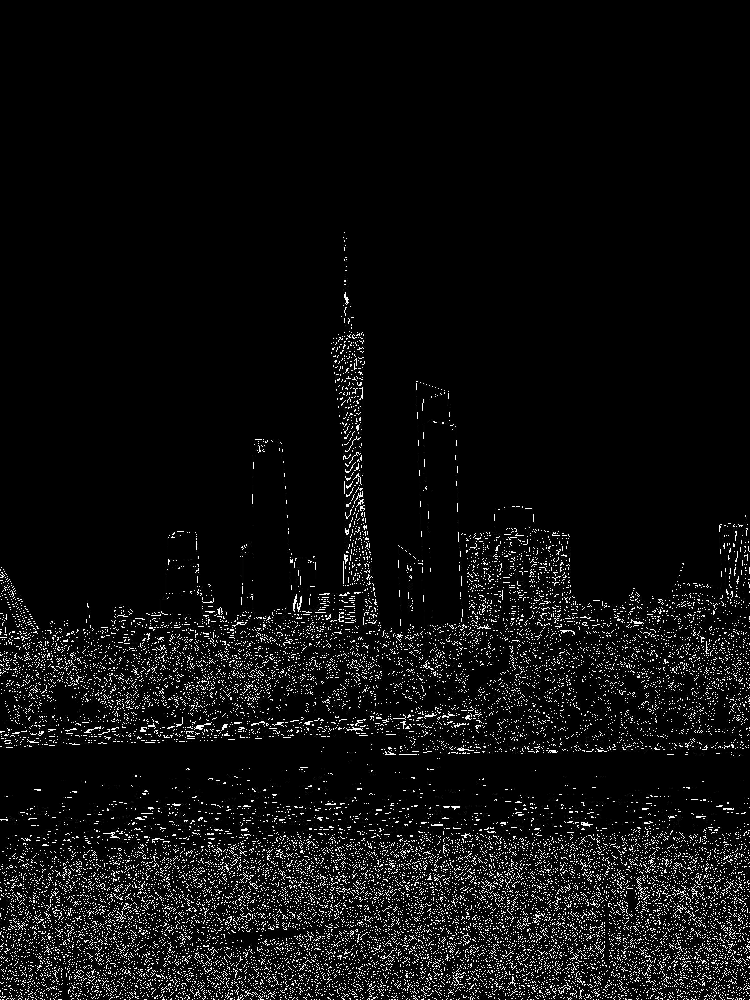
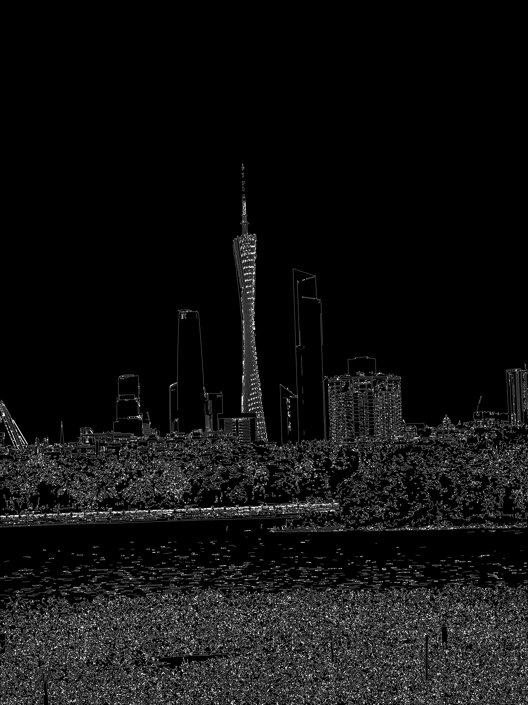
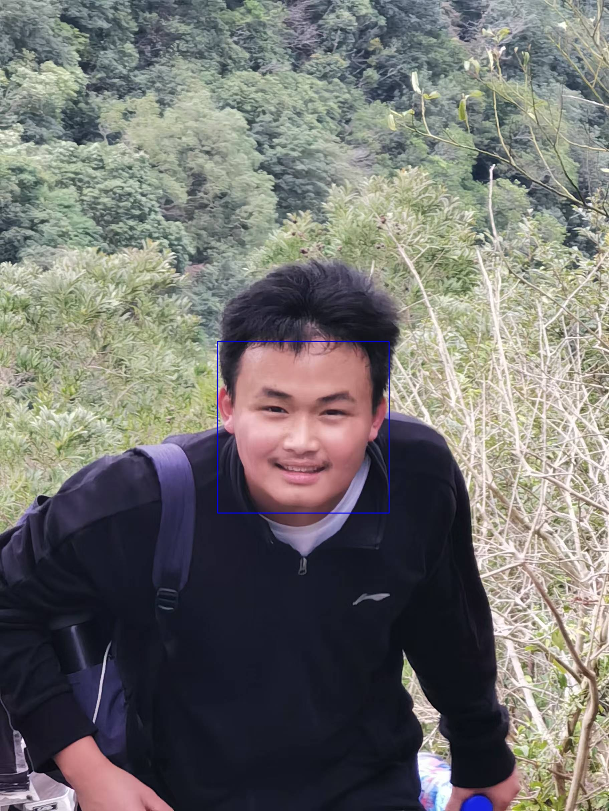

# 第二周任务说明

---
- Author: 郑思扬
- Reviced: 郑思扬
- Date: 2024-11-29
- Version: 1.0.0
- Abstract: 空队第二周任务说明

---
## 安装opencv
1. 从官网上下载 **opencv源码**，我选择的是opencv4.5.5 source  
2. 安装依赖项  
```
$ sudo apt-get install build-essential libgtk2.0-dev libjpeg-dev  libtiff5-dev libopenexr-dev libtbb-dev
$ sudo apt-get install libavcodec-dev libavformat-dev libswscale-dev libgtk-3-dev libgstreamer1.0-dev libgstreamer-plugins-base1.0-dev pkg-config
```
3. 安装opencv  
将opencv压缩包解压至 **home 目录**下
```
$ unzip opencv-4.5.5.zip
```  
&emsp;&emsp;创建 **build 文件夹**，进行 cmake 分析
```
$ cd opencv-4.5.5/
$ mkdir build
$ cd build
$ cmake ..
```
&emsp;&emsp;用 make 进行编译
```
$ sudo make -j4
```
&emsp;&emsp;编译过程可能耗时较长  
&emsp;&emsp;等待编译完成后进行安装
```
$ sudo make install
```
4. 配置环境变量
&emsp;&emsp;首先找到 **opencv4.pc** 的位置，例如我的就在 /usr/lib/x86_64-linux-gnu/pkgconfig/
```
$ locate opencv4.pc
```
&emsp;&emsp;然后将其改名为 **opencv.pc**
```
$ sudo mv opencv4.pc opencv.pc
```
&emsp;&emsp;修改 **/etc/ld.so.conf文件**
```
$ sudo gedit /etc/ld.so.conf
```
&emsp;&emsp;加入你的 opencv 路径
```
include /usr/lib/x86_64-linux-gnu
```
&emsp;&emsp;输入命令使得conf生效
```
$ sudo ldconfig
```
&emsp;&emsp;修改 **bash.bashrc文件**
```
$ sudo gedit /etc/bash.bashrc 
```
&emsp;&emsp;在末尾加入
```
PKG_CONFIG_PATH=$PKG_CONFIG_PATH:/usr/local/lib/pkgconfig
export PKG_CONFIG_PATH
```
&emsp;&emsp;然后source使得bash生效
```
$ source /etc/bash.bashrc
```
&emsp;&emsp;最后验证是否安装配置成功
```
$ pkg-config opencv --modversion
```
&emsp;&emsp;若显示版本号则安装成功

---
## 任务一
#### 代码内容说明
> - Functions:   
>   &emsp;利用 OpenCV 对任意一张图片进行 灰度化、高斯模糊、边缘检测、膨胀、腐蚀 等基础处理操作。
> - Depend Libraries:  
>   &emsp;依赖 - opencv  
>   &emsp;依赖 - numpy
#### 代码
- [image_processing.py](./Week2Task1/image_processing.py)
```python
import cv2
import numpy as np

# 读取图片
image = cv2.imread('/mnt/hgfs/Ubuntu-20.04.6-sharefiles/UbuntuOpencvFile/Week2Task1/IMG_20230831_120526.jpg')

# 灰度化
gray = cv2.cvtColor(image, cv2.COLOR_BGR2GRAY)

# 高斯模糊
blurred = cv2.GaussianBlur(gray, (5, 5), 0)

# 边缘检测
edges = cv2.Canny(blurred, 100, 200)

# 膨胀
dilated = cv2.dilate(edges, None, iterations=1)

# 腐蚀
eroded = cv2.erode(dilated, None, iterations=1)

# 显示图片
cv2.imshow('Original', image)
cv2.imshow('Gray', gray)
cv2.imshow('Blurred', blurred)
cv2.imshow('Edges', edges)
cv2.imshow('Dilated', dilated)
cv2.imshow('Eroded', eroded)

# 等待按键后关闭所有窗口
cv2.waitKey(0)
cv2.destroyAllWindows()

#保存处理过后的图片
cv2.imwrite('gray.jpg', gray)
cv2.imwrite('blurred.jpg', blurred)
cv2.imwrite('edges.jpg', edges)
cv2.imwrite('dilated.jpg', dilated)
cv2.imwrite('eroded.jpg', eroded)
```
#### 运行过程
&emsp;在程序所在的文件夹下打开终端  
&emsp;运行程序
```
$ python3 image_processing.py
```
即可查看到[处理结果](./Week2Task1)
- 灰度化

- 高斯模糊

- 边缘检测

- 膨胀

- 腐蚀


---
## 任务二
#### 代码内容说明
> - Functions:   
>   &emsp;利用opencv已有的库实现人脸识别。
> - Depend Libraries:  
>   &emsp;依赖 - opencv
#### 代码
- [face_recognition.py](./Week2Task2/face_recognition.py)
```python
import cv2

def faceDetect():
    #转换为灰度图
    gray = cv2.cvtColor(img, cv2.COLOR_BGR2GRAY)
    # 加载预训练的人脸检测模型
    face_cascade = cv2.CascadeClassifier('/home/ethan/opencv-4.5.5/data/haarcascades/haarcascade_frontalface_default.xml')
    # 检测人脸
    faces = face_cascade.detectMultiScale(gray, scaleFactor=1.1, minNeighbors=5, minSize=(300, 300), maxSize = (800, 800))
    # 绘制矩形框
    for (x, y, w, h) in faces:
        cv2.rectangle(img, (x, y), (x+w, y+h), (255, 0, 0), 2)
    # 显示结果
    cv2.imshow('Face Detection', img)

# 加载图像
img = cv2.imread('/mnt/hgfs/Ubuntu-20.04.6-sharefiles/UbuntuOpencvFile/Week2Task2/微信图片_20241128190549.jpg')

#检测函数
faceDetect()

#等待
while True:
    if ord('q') == cv2.waitKey(0):
        break

#释放内存
cv2.destroyAllWindows()

# 保存结果图像
success = cv2.imwrite('output_image.jpg', img)
if not success:
    print("Failed to save the image.")
```
#### 运行过程
&emsp;在项目文件夹下打开终端，运行指令
```
$ python3 face_recognition.py
```
&emsp;即可看到[处理结果](./Week2Task2/output_image.jpg)


---
## 配置yolov5
1. 从 **anaconda官网** 下载anaconda
2. 打开 **anaconda prompt**，cd到目标文件夹，创建 **python环境** 并激活
```
conda create -n pytorch_dl python=3.12
conda activate pytorch_dl
```
3. 配置pytorch  
确定**系统配置，包括操作系统、Python版本、CUDA版本**（如果有NVIDIA GPU）  
在pytorch官网上找到对应的安装指令并粘贴到 conda 中执行  
验证安装是否成功
```
python -c "import torch; print(torch.__version__)"
```
&emsp;&emsp;若显示 pytorch 版本则安装成功
4. 配置 yolov5  
将 yolov5的 **github 仓库**克隆到虚拟环境的文件夹中  
在 **anaconda prompt** 中cd到 yolov5的文件夹下
安装 yolov5 的依赖(可以换源下载)
```
pip install -r requirements.txt
```
&emsp;&emsp;到这里环境配置完成

---
## 任务三
#### 代码内容说明
> - Functions:   
>   &emsp;使用预训练权重yolov5s检测图片。
> - Depend Libraries:  
>   &emsp;依赖 - yolov5  
>   &emsp;依赖 - detect.py
#### 运行过程
&emsp;打开 **anaconda的虚拟环境**  
&emsp;cd到python解释器所在的文件夹,我的是
```
cd D:
cd D:\UserDFile\Pycharm\pytorch_dl
```
&emsp;然后激活 **python环境**
```
conda activate D:\UserDFile\Pycharm\pytorch_dl
```
&emsp;然后cd到包含[待处理图片](./Week2Task3/street.jpg)的文件夹，例如
```
cd D:\UserDFile\GithubFileClone\Tutorial_2024\workspace\Week2\Week2Task3
```
&emsp;运行指令
```
python D:/UserDFile/Pycharm/pytorch_dl/yolov5/yolov5/detect.py --weights yolov5s.pt --img 640 --conf 0.25 --source D:/UserDFile/GithubFileClone/Tutorial_2024/workspace/Week2/Week2Task3/street.jpg
```
&emsp;其中 D:/UserDFile/Pycharm/pytorch_dl/yolov5/yolov5/detect.py 换为你的 detect.py路径  
&emsp;D:/UserDFile/GithubFileClone/Tutorial_2024/workspace/Week2/Week2Task3/street.jpg 换位你的图片路径
&emsp;然后便可按提示在 yolov5\runs\detect\exp 中查看到[识别结果](./Week2Task3/street_recognition.jpg)
