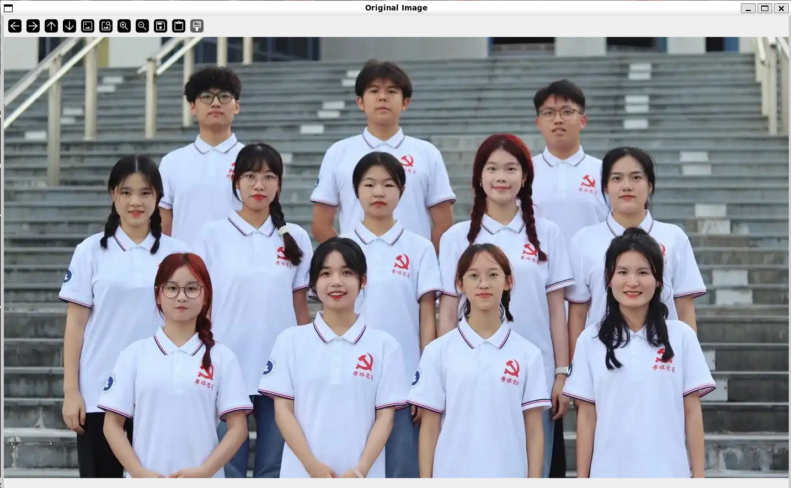
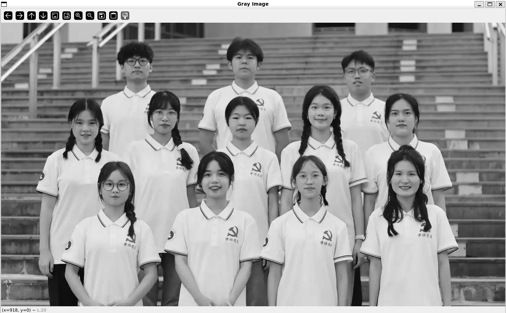
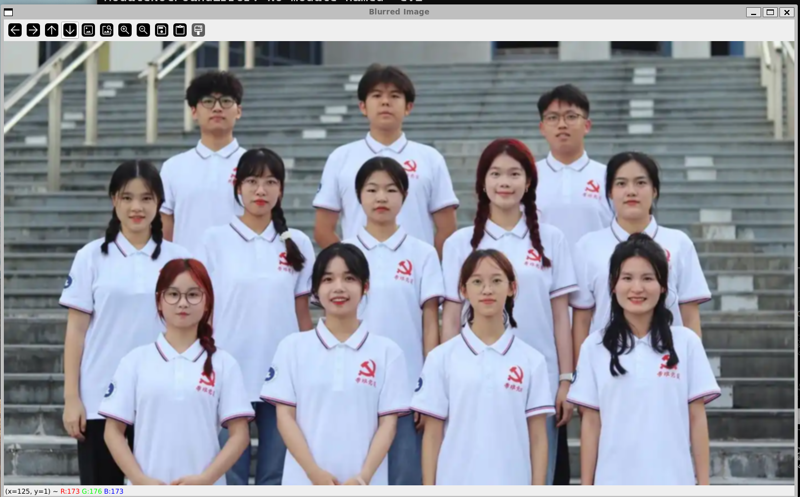
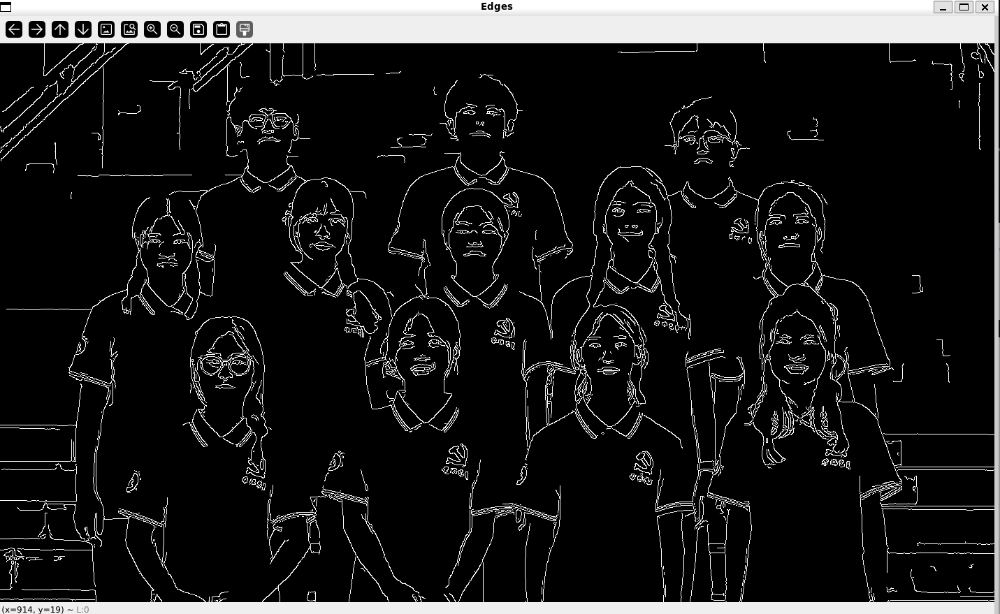
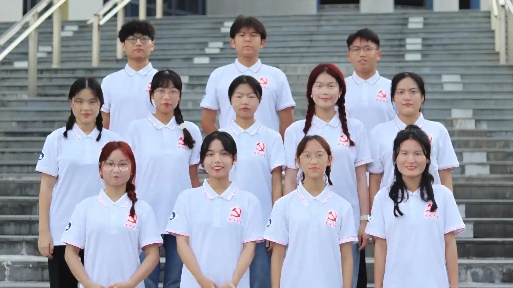
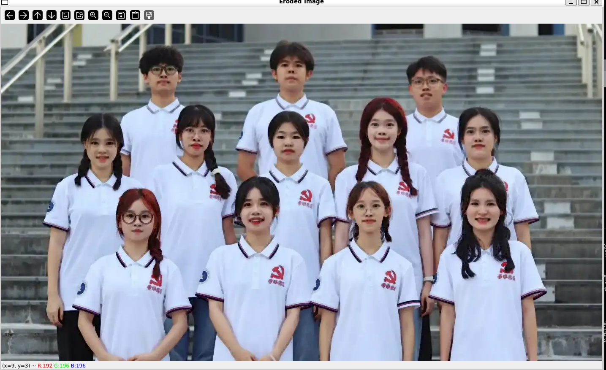
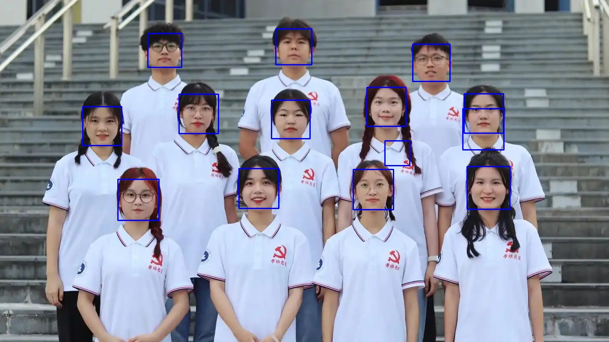

# Week2_视觉组

## 初识OpenCV

### 更新`apt`源
```bash
sudo apt-get update
```
### 安装 OpenCV 相关库
```bash
sudo apt-get install libopencv-dev python3-opencv
```
### 基础处理操作

#### 代码
```python
import cv2

# 读取图片
image = cv2.imread('image.png')

# 灰度化
gray_image = cv2.cvtColor(image, cv2.COLOR_BGR2GRAY)

# 高斯模糊
blurred_image = cv2.GaussianBlur(image, (5, 5), 0)

# 边缘检测
edges = cv2.Canny(image, 100, 200)

# 膨胀操作
kernel = cv2.getStructuringElement(cv2.MORPH_RECT, (3, 3))
dilated_image = cv2.dilate(image, kernel, iterations = 1)

# 腐蚀操作
eroded_image = cv2.erode(image, kernel, iterations = 1)

# 显示结果
cv2.imshow('Original Image', image)
cv2.imshow('Gray Image', gray_image)
cv2.imshow('Blurred Image', blurred_image)
cv2.imshow('Edges', edges)
cv2.imshow('Dilated Image', dilated_image)
cv2.imshow('Eroded Image', eroded_image)
cv2.waitKey(0)
cv2.destroyAllWindows()
```

#### 结果







## 调用 OpenCV 已有的库实现人脸识别

### 代码
```python
import cv2

# 加载 Haar 特征分类器
face_cascade = cv2.CascadeClassifier('haarcascade_frontalface_default.xml')

# 读取图片
image_path = 'image.png'
image = cv2.imread(image_path)

# 转换为灰度图
gray = cv2.cvtColor(image, cv2.COLOR_BGR2GRAY)

# 检测人脸
faces = face_cascade.detectMultiScale(gray, scaleFactor=1.1, minNeighbors=5, minSize=(30, 30))

# 绘制检测框
for (x, y, w, h) in faces:
    cv2.rectangle(image, (x, y), (x+w, y+h), (255, 0, 0), 2)

# 保存结果
cv2.imwrite('output.jpg', image)
print("Image saved as output.jpg")
# 没有GUI,直接保存嘿嘿
# 但为什么前面图像处理可以？不懂
```

### 结果


## 配置 python，使用 Anaconda 来进行包和版本管理
看似最简单的任务，实际上我在VMware workstation中的虚拟机内存满了，腾了一个下午的空间，发现扩展内存好麻烦。最后投奔wsl，重新配置了一遍环境，catkin什么的也装了，真的麻了

### 下载并安装Anaconda

#### 创建 Anaconda 虚拟环境
```bash
conda create -n yolov5_env python=3.8
conda activate yolov5_env
```

#### 部署 Yolov5
```bash
git clone https://github.com/ultralytics/yolov5.git
cd yolov5
pip install -r requirements.txt
```

## 检测图片
用了其自带的那个detect.py嘿嘿

### 下载预训练权重`yolov5s.pt`

### 代码
实际上就是自带那个detect.py，注释太多，就不复制在这了

### 运行(在环境中)
```bash
python detect.py --source image.png --weights yolov5s.pt --conf 0.5
```

### 结果


## 对部分OpenCV函数接口的理解

#### `cv2.imread('object.jpg')`
I'm reading，呸，image read顾名思义嘛，是读取图像的，对象是一个图像数据，把它先拿出来，把它放到image备用

#### `cv2.cvtColor(image,某一种色彩空间)`
应该是convert的缩写，相当于把image的色彩空间转化成我们要的

#### `cv2.GaussianBlur()`
e,只知道是高斯模糊的函数，原理一知半解，和高斯分布有关？取邻域，像素值分权重

#### `cv2.Canny()`
降噪之后，通过像素点的变化程度来确定边缘

#### `cv2.getStructuringElement()`
有指定形状和大小地生成一个整体，这个整体会被当做后面操作的单位邻域

#### `cv2.dilate()`
对目标image进行膨胀，对每个像素的单位邻域进行检查，检查出邻域中有前景像素，比如白色之类的的话，就会设置其为前景像素，效果就是膨胀（会使人像变得好抽象）

#### `cv2.erode()`
和dilate类似，他也会检查前景像素，但是只有邻域中全是前景像素的时候，他才会被设置为前景像素，效果就收缩了

## 选做部分
哈哈，麻了，我wsl下的是 Ubuntu 24.04.1，没有ros1
继续重开