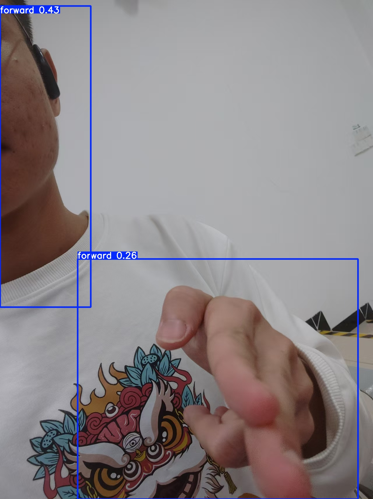
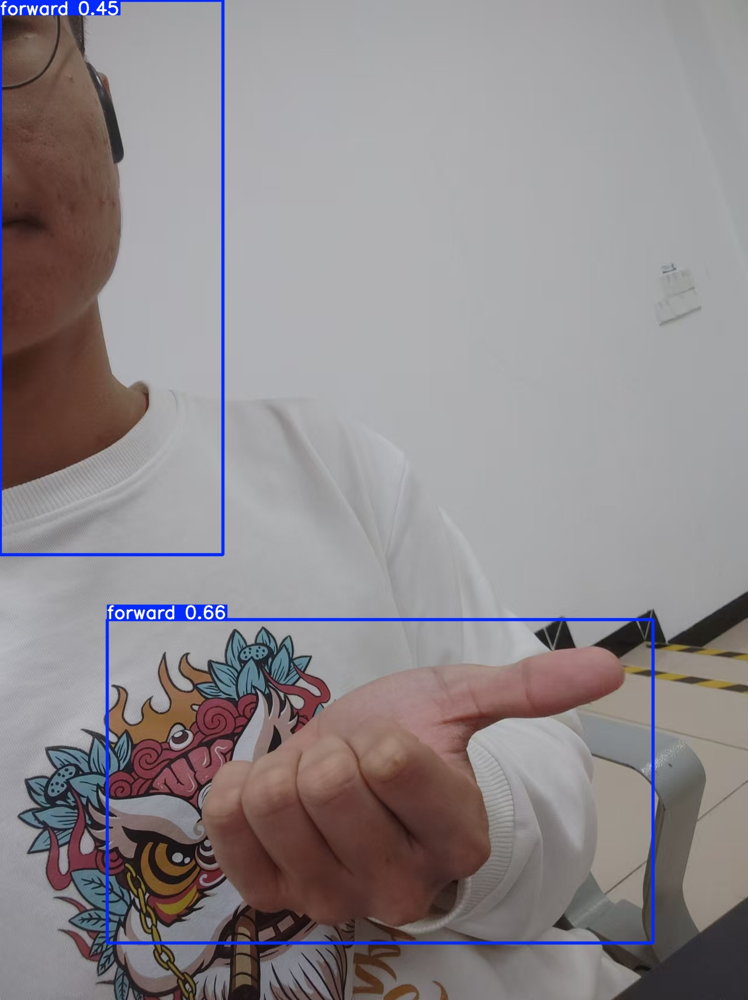
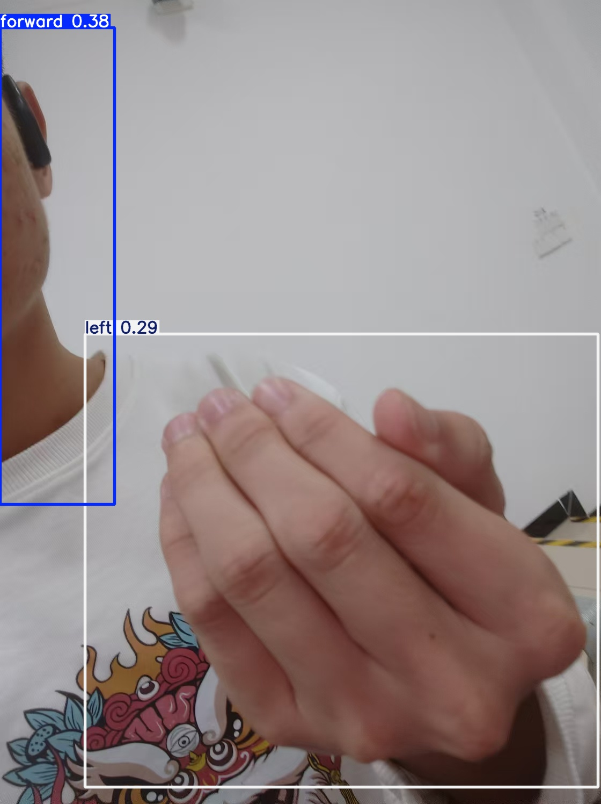
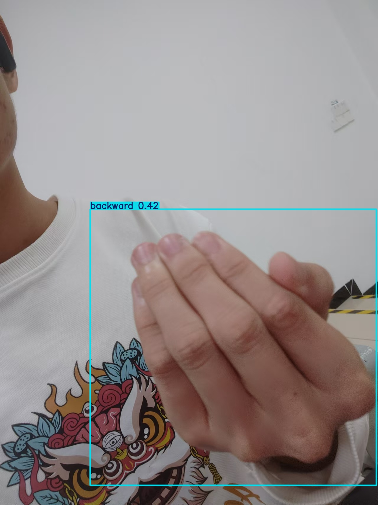
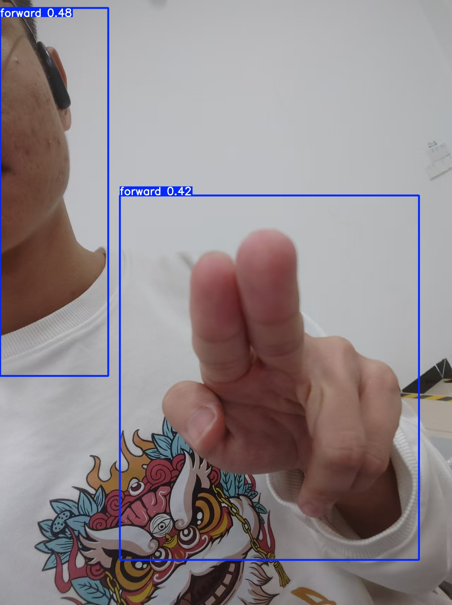
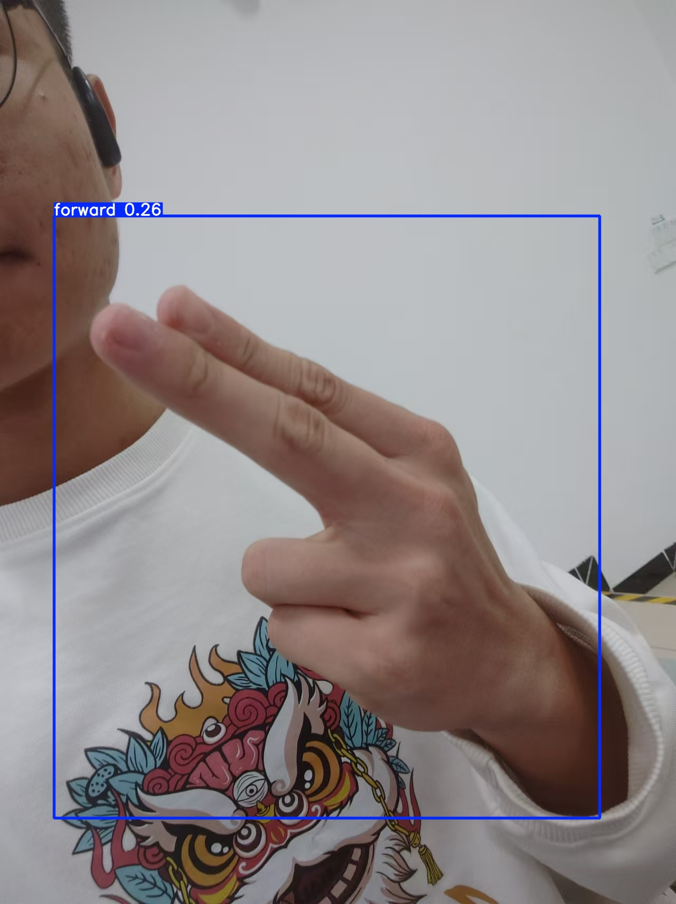
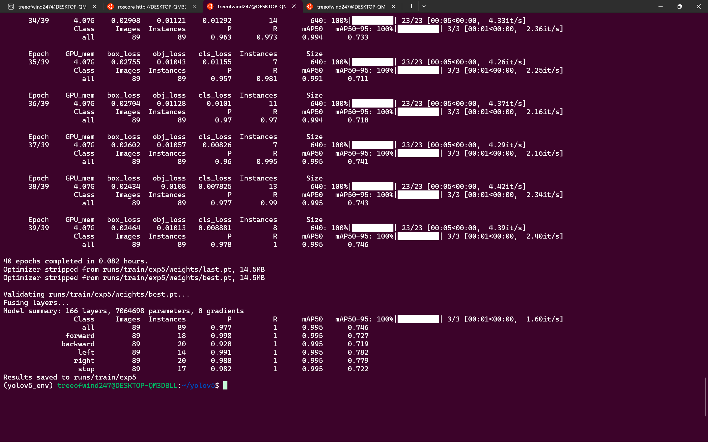
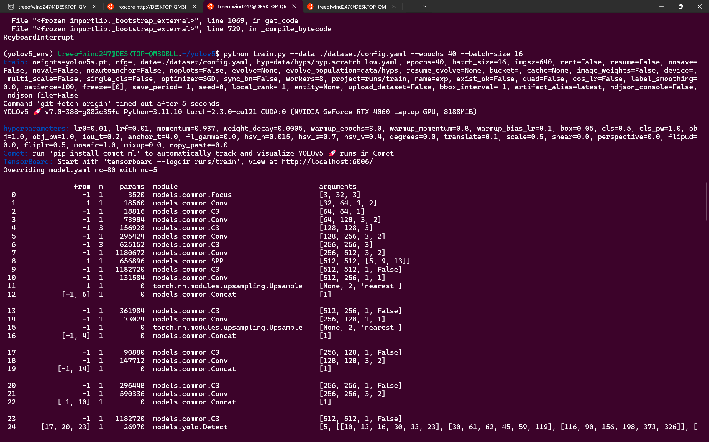
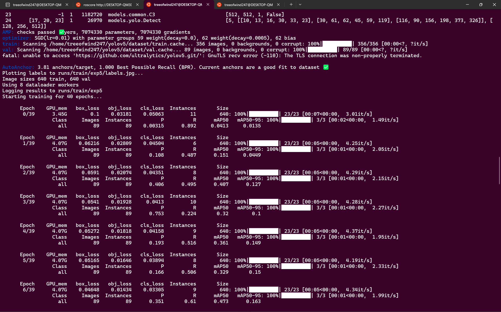

## 视觉组第三周考核任务

### 自己拍，自己预测

#### 结果
结果好抽象







### 试图让 Windows 主系统的 USB 摄像头可以连接并识别到 WSL 子系统中

花了一个下午，把油管和指引都做了一遍，fail。究其原因好像是因为下载的是zip安装包，并在外面解压，再copy进去的，我回头再试，不信了。

### 自己训练权重

#### 将dataset.zip解压并放在yolov5的根目录

#### 打乱分割数据集
运行```python process_data.py```
把数据集打乱和分割成训练集、验证集和测试集


#### 训练
###### yolo文件夹下,运行```python train.py --data ./dataset/config.yaml```
在这里本来看到epoch的默认值是100，有点太多了，会不会过拟合，后面查资料和到处问等等途径，才发现其实到最后运行的是`best.pt`,他是会在里面取一个最佳的结果的。




#### 推理
```
python detect.py --weights ./runs/train/exp6/weights/best.pt  --source ./dataset/test/images/
```
结果存在`runs/detect/`

### 试图通过话题订阅的方式控制小车

#### 喂给gpt detect.py的代码，并要求逐行注释
初步读懂detect代码

#### 思路
##### 在detect的run函数中添加Ros发布话题的逻辑

```py
rospy.init_node('gesture_publisher', anonymous=True)
    gesture_pub = rospy.Publisher('gesture_topic', String, queue_size=10)
```

```py

detections = pred[0]  # pred[0] 是预测结果，det[0] 包含的是边框、类标签和置信度

# 然后遍历 detections 进行后续处理
for det in detections:  # detections 是每个检测框的结果
    # det 可能包含框坐标, 类别, 置信度等信息
    xyxy = det[:4]  # 这里假设 det 是一个包含 [x1, y1, x2, y2, confidence, class] 的张量
    confidence = det[4].item()  # 获取置信度
    class_id = int(det[5].item())  # 获取类 ID
    # 在这里可以对每个检测框进行进一步处理，例如发布手势信息
    print(f"Detected {class_id} with confidence {confidence:.2f} at coordinates {xyxy}")

```

##### 小车控制节点
```py
#!/usr/bin/env python

import rospy
from std_msgs.msg import String
from geometry_msgs.msg import Twist

def control_car(command):
    """
    根据手势命令控制小车的回调函数。

    参数：
        command (String): 检测到并发布的手势命令。
    """
    twist = Twist()  # 创建一个 Twist 消息实例，用于发布速度指令
    if command.data == "forward":  # 如果手势命令是“forward”
        twist.linear.x = 1.0  # 设置线速度为正值，小车前进
    elif command.data == "backward":  # 如果手势命令是“backward”
        twist.linear.x = -1.0  # 设置线速度为负值，小车后退
    elif command.data == "left":  # 如果手势命令是“left”
        twist.angular.z = 1.0  # 设置角速度为正值，小车左转
    elif command.data == "right":  # 如果手势命令是“right”
        twist.angular.z = -1.0  # 设置角速度为负值，小车右转
    else:  # 其他命令或无效命令
        twist.linear.x = 0.0  # 停止线速度
        twist.angular.z = 0.0  # 停止角速度

    rospy.loginfo(f"Car action: {command.data}")  # 在日志中打印当前动作
    cmd_vel_pub.publish(twist)  # 发布 Twist 消息给小车


if __name__ == "__main__":
    rospy.init_node('car_controller', anonymous=True)  # 初始化 ROS 节点
    cmd_vel_pub = rospy.Publisher('/cmd_vel', Twist, queue_size=10)  # 创建发布者发布到 /cmd_vel 话题
    rospy.Subscriber('gesture_topic', String, control_car)  # 订阅 'gesture_topic' 话题
    rospy.spin()  # 保持节点运行，等待回调

```

##### 集成检测为 ROS 节点
```py
#!/usr/bin/env python

import rospy
from detect import run

if __name__ == "__main__":
    rospy.init_node('gesture_node', anonymous=True)  # 初始化 ROS 节点
    try:
        # 调用 detect.py 中的 run 函数，进行推理并发布手势识别结果
        run(weights='path/to/yolov5s.pt', source='path/to/video', save_txt=True)
    except rospy.ROSInterruptException:  # 捕获 ROS 中断异常
        pass

```

##### 编写启动文件
```xml
<launch>
    <!-- 启动手势识别节点 -->
    <node pkg="gesture_control" type="gesture_node.py" name="gesture_node" output="screen" />
    
    <!-- 启动车控制节点 -->
    <node pkg="gesture_control" type="car_controller.py" name="car_controller" output="screen" />
</launch>

```
#### 结果尚未完整完成
PS：用gpt辅助，还有很多一知半解