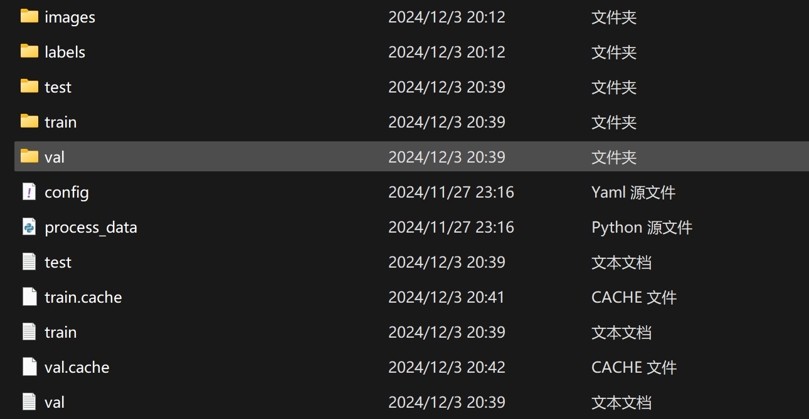
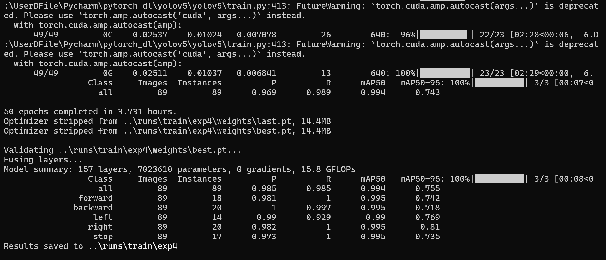
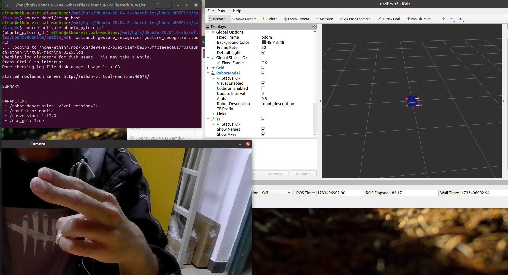

# 第三周任务说明

---
- Author: 郑思扬
- Reviced: 郑思扬
- Date: 2024-12-3
- Version: 1.0.0
- Abstract: 空队第三周任务说明

---
## 任务一
### 识别拍摄手势
#### 任务内容说明
> - Functions:   
>   &emsp;利用给出的权重对五种手势的图片进行推理
> - Depend Libraries:  
>   &emsp;依赖 - yolov5  
>   &emsp;依赖 - detect.py
#### 运行过程
&emsp;打开 **anaconda的虚拟环境**  
&emsp;cd到python解释器所在的文件夹,我的是
```
D:
cd D:\UserDFile\Pycharm\pytorch_dl
```
&emsp;然后激活 **python环境**
```
conda activate D:\UserDFile\Pycharm\pytorch_dl
```
&emsp;然后cd到包含[待处理图片](./Week3Task1/)的文件夹，例如
```
cd D:\UserDFile\GithubFileClone\Tutorial_2024\workspace\Week3\Week3Task1
```
&emsp;运行指令
```
python D:/UserDFile/Pycharm/pytorch_dl/yolov5/yolov5/detect.py --weights D:/UserDFile/GithubFileClone/Tutorial_2024/tasks/week3/视觉组/source/exp6/weights/best.pt --img 640 --conf 0.25 --source D:/UserDFile/GithubFileClone/Tutorial_2024/workspace/Week3/Week3Task1/test photo
```
&emsp;其中路径需要替换成实际路径
&emsp;然后按照提示的路径即可找到[识别结果](./Week3Task1/result%20photo/)
.jpg)
.jpg)
.jpg)
&emsp;这里只列举几个
### 摄像头实时预测
#### 任务内容说明
> - Functions:   
>   &emsp;利用使用电脑摄像头实时进行手势预测
> - Depend Libraries:  
>   &emsp;依赖 - yolov5  
>   &emsp;依赖 - detect.py
#### 运行过程
&emsp;打开 **anaconda的虚拟环境**  
&emsp;cd到python解释器所在的文件夹,我的是
```
D:
cd D:\UserDFile\Pycharm\pytorch_dl
```
&emsp;然后激活 **python环境**
```
conda activate D:\UserDFile\Pycharm\pytorch_dl
```
&emsp;运行指令
```
python D:/UserDFile/Pycharm/pytorch_dl/yolov5/yolov5/detect.py --weights D:/UserDFile/GithubFileClone/Tutorial_2024/tasks/week3/视觉组/source/exp6/weights/best.pt --source 0
```
&emsp;[运行结果截图](./Week3Task1/print%20screen/)


这里只列举几个

---
## 任务二
#### 任务内容说明
> - Functions:   
>   &emsp;利用数据集训练一个手势识别模型
> - Depend Libraries:  
>   &emsp;依赖 - yolov5  
>   &emsp;依赖 - train.py
#### 运行过程
&emsp;将提供的 **dataset文件夹** 复制到yolov5的根目录下  
&emsp;打开 **anaconda的虚拟环境**  
&emsp;cd到python解释器所在的文件夹,我的是
```
D:
cd D:\UserDFile\Pycharm\pytorch_dl
```
&emsp;然后激活 **python环境**
```
conda activate D:\UserDFile\Pycharm\pytorch_dl
```
&emsp;然后cd 到 dataset文件夹下
```
cd  D:\UserDFile\Pycharm\pytorch_dl\yolov5\yolov5\dataset
```
&emsp;然后需要对数据集的数据进行处理，利用**process_data.py**将数据集打乱和分割成训练集、验证集和测试集。
```
python process_data.py
```
&emsp;在dataset文件夹下会生成以下文件/文件夹：
+ `test`
+ `train`
+ `val`
+ `train.txt`
+ `val.txt`
+ `test.txt`

&emsp;然后返回到 **yolov5** 文件夹下，用数据集训练一个权重
```
 D:/UserDFile/Pycharm/pytorch_dl/yolov5/yolov5/train.py --data D:/UserDFile/Pycharm/pytorch_dl/yolov5/yolov5/dataset/config.yaml --epochs 50 --batch-size 16
```
&emsp;经过漫长的等待，训练完成

&emsp;按照提示路径可以看到[训练结果和得到的权重](./Week3Task2/exp4/)
&emsp;然后利用训练得到的权重按任务一中步骤进行手势识别即可

---
## 任务三
#### 任务内容说明
> - Functions:   
>   &emsp;利用数据集训练一个手势识别模型
> - Depend Libraries:  
>   &emsp;依赖 - yolov5  
>   &emsp;依赖 - opencv
#### 代码
- [main.cpp](./Week3Task3/main.cpp)
```C++
#include "parser.h"
#include <urdf/model.h>
#include <string>
#include <sensor_msgs/JointState.h>
#include <tf/transform_broadcaster.h>
#include <geometry_msgs/Point.h>
#include <ros/ros.h>
#include <random>
#include <iomanip>
#include <std_msgs/String.h>
using namespace std;

float yaw = 0.0;
SVector3 velocity={0, 0, 0};  //速度向量

// 假设手势识别结果是一个字符串消息
void gestureCallback(const std_msgs::String::ConstPtr& msg) {
    ROS_INFO("Received gesture: %s", msg->data.c_str());
    // 根据接收到的手势指令控制小车
    // 这里需要根据手势识别结果来设置小车的速度和方向
    // 例如：
    if (msg->data == "forward") {
        // 小车前进
        velocity = {0.1, 0, 0};
    } else if (msg->data == "backward") {
        // 小车后退
        velocity = {-0.1, 0, 0};
    } else if (msg->data == "left") {
        // 小车左转
        yaw -= 0.1;
    } else if (msg->data == "right") {
        // 小车右转
        yaw += 0.1;
    } else if (msg->data == "stop") {
        // 小车停止
        velocity = {0, 0, 0};
    }
}

int main(int argc, char** argv) {
    ros::init(argc, argv, "state_publisher");
    ros::NodeHandle n;
	little_car car;//初始化控制对象  小车
    car.joint_pub = n.advertise<sensor_msgs::JointState>("joint_states", 1);
	car.pos_pub = n.advertise<geometry_msgs::Point>("car_position",1); //小车的位置消息发布
	
	//添加一个Subscriber，从手势识别Publisher处订阅指令
    ros::Subscriber gesture_sub = n.subscribe<std_msgs::String>("gesture_topic", 1, gestureCallback);


    ros::Rate loop_rate(60);
	// SVector3 velocity={0, 0, 0};  //速度向量
	car.set_noise_level(0);		   //设置噪声等级
	// float yaw = 0.0;
    while (ros::ok()) {
	//	yaw += 0.01;
		car.set_velocity(velocity);//设置小车速度
    	car.set_yaw(yaw); 		   //修改小车的方向
        car.update_();//小车状态更新
		loop_rate.sleep();
    }


    return 0;
}
```
- [gesture_publisher.cpp](./Week3Task3/gesture_publisher.cpp)
```C++
#include <cstdio>
#include <iostream>
#include <string>
#include <stdexcept>
#include <ros/ros.h>
#include <std_msgs/String.h>
#include <opencv2/opencv.hpp>
#include <cv_bridge/cv_bridge.h>
#include <sensor_msgs/image_encodings.h>
#include <opencv2/opencv.hpp>
#include <nlohmann/json.hpp>

std::string detectGesture(const cv::Mat& frame) {
    // 创建一个临时文件名
    std::string tempImageFile = "/tmp/camera_frame.jpg";
    cv::imwrite(tempImageFile, frame); // 将图像保存到临时文件

    // 构建调用detect.py的命令
    std::string command = "python /home/ethan/yolov5/detect.py --weights /home/ethan/yolov5/weights/best.pt --source" + tempImageFile;

    // 使用popen执行命令并读取输出
    std::array<char, 128> buffer;
    std::string json_output;
    std::unique_ptr<FILE, decltype(&pclose)> pipe(popen(command.c_str(), "r"), pclose);
    if (!pipe) {
        throw std::runtime_error("popen() failed!");
    }
    while (fgets(buffer.data(), buffer.size(), pipe.get()) != nullptr) {
        json_output += buffer.data();
    }

    // 删除临时文件
    std::remove(tempImageFile.c_str());

    // 解析 JSON 输出
    nlohmann::json j = nlohmann::json::parse(json_output);
    std::string result;

    // 假设我们只关心第一个检测到的对象的类别
    if (!j["detections"].is_null() && !j["detections"].empty()) {
        auto& detection = j["detections"][0];
        result = detection["class"].get<std::string>();
    }

    if (result.empty()) {
        throw std::runtime_error("No output from detect.py or no detections found");
    }

    return result;
}

void imageCallback(const sensor_msgs::ImageConstPtr& msg) {
    try {
        cv::Mat frame = cv_bridge::toCvShare(msg, sensor_msgs::image_encodings::BGR8)->image;
        // 调用YOLOv5进行手势识别
        std::string gesture = detectGesture(frame);
        std_msgs::String msg;
        msg.data = gesture;
        ros::NodeHandle nh;
        ros::Publisher gesture_pub = nh.advertise<std_msgs::String>("gesture_topic", 1);
        gesture_pub.publish(msg);
    } catch (const cv_bridge::Exception& e) {
        ROS_ERROR("Could not convert from '%s' to 'bgr8'.", msg->encoding.c_str());
    } catch (const std::runtime_error& e) {
        ROS_ERROR("Error during gesture detection: %s", e.what());
    }
}

int main(int argc, char** argv) {
    ros::init(argc, argv, "gesture_publisher");
    ros::NodeHandle nh;
    ros::Subscriber image_sub = nh.subscribe("/camera/image_raw", 10, imageCallback);
    ros::spin();
    return 0;
}
```
- [camera_publisher.py](./Week3Task3/camera_publisher.py)
```python
#!/usr/bin/env python

import rospy
import cv2
from sensor_msgs.msg import Image
from cv_bridge import CvBridge
import sys

def main():
    # 初始化 ROS 节点
    rospy.init_node('opencv_camera_publisher', anonymous=True)

    # 设置发布话题
    image_pub = rospy.Publisher('/camera/image_raw', Image, queue_size=10)

    # 创建 CvBridge 对象
    bridge = CvBridge()

    # 打开摄像头
    cap = cv2.VideoCapture(0)  # 0 表示默认摄像头

    if not cap.isOpened():
        print("Error: Could not open video stream.")
        sys.exit()

    rate = rospy.Rate(10)  # 设置发布频率 10Hz

    while not rospy.is_shutdown():
        # 从摄像头读取图像
        ret, frame = cap.read()

        if not ret:
            print("Error: Failed to capture image.")
            break

        # 将 OpenCV 图像转换为 ROS 图像消息
        try:
            ros_image = bridge.cv2_to_imgmsg(frame, "bgr8")
        except Exception as e:
            print(e)
            continue

        # 发布图像消息
        image_pub.publish(ros_image)

        # 显示图像
        cv2.imshow("Camera", frame)

        # 按下 'q' 键退出
        if cv2.waitKey(1) & 0xFF == ord('q'):
            break

        rate.sleep()

    # 释放摄像头并关闭所有窗口
    cap.release()
    cv2.destroyAllWindows()

if __name__ == '__main__':
    main()
```
#### 编译过程
&emsp;首先将 little_car 包放在 ROS 的工作空间下  
&emsp;将其中的src/main.cpp更改为以上代码  
&emsp;然后创建一个新的 package 
```
$ catkin_create_pkg gesture_recognizer roscpp rospy std_msgs geometry_msgs sensor_msgs cv_bridge
$ cd src
$ sudo gedit gesture_publisher.cpp
```
&emsp;将 gesture_publisher.cpp 粘贴进来  
&emsp;然后修改CMakelLists.txt 和 package.xml
&emsp;**然后编写 gesture_recognizer 的 launch 文件**
```
$ mkdir launch
$ sudo gedit gesture_recognizer.launch
```
```launch
<launch>
    <!-- 启动手势识别发布者节点 -->
    <node name="gesture_publisher" pkg="gesture_recognizer" type="gesture_publisher" output="screen"/>
</launch>
```
&emsp;将上周的opencv_ros_camera包也放进 ROS 的工作空间  
&emsp;然后对工作空间进行编译
```
$ catkin_make
```
#### 运行过程
&emsp;首先将摄像头连接至虚拟机  
&emsp;虚拟机->可移动设备->摄像头->连接至虚拟机（与主机断开）  
&emsp;并将虚拟机的 USB 设置为支持 USB 3.1  
&emsp;可以先运行 cheese 检查摄像头状态  
```
$ cheese
```
&emsp;先运行 ros master
```
$ roscore
```
&emsp;在 ROS 工作空间打开终端，先运行 little_car 
```
$ source devel/setup.bash
$ roslaunch little_car little_car.launch
```
&emsp;打开一个新的终端，运行 gesture_recognizer
&emsp;先激活python虚拟环境
```
source activate ubuntu_pytorch_dl
```
```
$ source devel/setup.bash
$ roslaunch gesture_recognizer gesture_recongnizer.launch
```
&emsp;最后运行opencv_ros_camera
```
$ source devel/setup.bash
$ rosrun opencv_ros_camera camera_publisher.py
```

---
## 任务四
#### 任务内容说明
> - Functions:   
>   &emsp;编写一个launch文件启动整个项目
> - Depend Libraries:  
>   &emsp;依赖 - yolov5  
>   &emsp;依赖 - opencv
#### 代码
- [gesture_recognizer.launch](./Week3Task3/gesture_recognizer.launch)
```launch
<launch>
    <!-- 启动 camera_publisher.py 节点 -->
    <node name="camera_publisher" pkg="opencv_ros_camera" type="camera_publisher.py" output="screen" />

    <!-- 启动 gesture_publisher 节点 -->
    <node name="gesture_publisher" pkg="gesture_recognizer" type="gesture_publisher" output="screen" />

    <!-- 包含 little_car 的 launch 文件 -->
    <include file="$(find little_car)/launch/little_car.launch" />

    <!-- 如果需要设置额外的参数，可以使用 <param> 标签 -->
    <!-- <param name="parameter_name" value="parameter_value" /> -->
</launch>
```
#### 运行过程
&emsp;首先运行ros master
```
$ roscore
```
&emsp;激活python虚拟环境
```
source activate ubuntu_pytorch_dl
```
&emsp;然后运行 gesture_recognizer.launch
```
roslaunch gesture_recognizer gesture_recognizer.launch
```
&emsp;然后即可看到[运行结果](./Week3Task3/result.png)

但很遗憾，我的小车好像没有移动
## 我对项目的理解

​        为了能够识别手势信息，我们需要先训练一个神经网络的权重实现对手势分类。首先建立一个数据集，拍摄forward, backward, left, right, stop五种控制手势，然后人工为每个手势打上标签，并用process_data.py 进行预处理，将数据集划分为训练集和测试集。调用yolov5 中的 train.py 对数据集进行训练，得到一个权重best.pt。

​        在这个项目中，我们首先建立了一个小车的模型 **little_car**，包括其大致的结构和关节，然后实现了一个小车的类以实现对小车的控制。

​        然后我们实现了一个节点从电脑的默认摄像头读取视频流，将视频流以单帧的图片形式获取为opencv图像，然后将opencv图像转化为 ROS 的图像信息并发送。

​       接着用一个节点接收话题中的ROS图像信息，用 yolov5 中的 detect.py 进行识别，权重使用我们训练的best.pt，将识别命令发送到终端，并从detect.py 脚本的输出中获取图像分类信息，包括forward, backward, left, right, stop，并发送到 ROS 话题中。

​       最后用 little_car 节点接收分类信息，转化为对小车的控制信号，实现对小车的控制。

​       为了能够更方便地启动这个项目，需要编写一个launch文件，依次启动各个节点，在最终使用时调用launch文件即可。