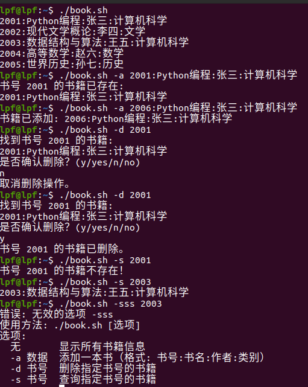

## 一、斐波那契数列——全部完成


### 1. 编写代码

```cpp
#include <iostream>
using namespace std;

// 函数：计算斐波那契数列的第 n 项
int fibonacci(int n) {
    // 如果 n 是 0，直接返回第 0 项
    if (n == 0) return 0;
    // 如果 n 是 1，直接返回第 1 项
    if (n == 1) return 1;

    // 初始化变量，a 表示 F(n-2)，b 表示 F(n-1)，result 用于存储当前项 F(n)
    int a = 0, b = 1, result = 0;

    // 从第 2 项开始迭代到第 n 项
    for (int i = 2; i <= n; ++i) {
        result = a + b; // 当前项等于前两项之和
        a = b;          // 更新 F(n-2) 为 F(n-1)
        b = result;     // 更新 F(n-1) 为 F(n)
    }
    return result; // 返回第 n 项的结果
}

int main() {
    int n; // 用于存储用户输入的 n 值

    // 提示用户输入 n
    cout << "输入：n = ";
    cin >> n; // 读取用户输入的 n

    // 检查输入是否在有效范围内 [0, 50]
    if (n < 0 || n > 50) {
        cout << "输入的 n 不在有效范围内。" << endl; // 提示用户输入无效
        return 1; // 返回错误码 1，表示程序异常终止
    }

    // 调用 fibonacci 函数计算第 n 项，并输出结果
    cout << "输出：" << fibonacci(n) << endl;

    return 0; // 返回 0，表示程序正常结束
}

```

### 2. 安装必要的工具

安装 `CMake` 和 `Make`

```
sudo apt update  
sudo apt install cmake make g++
```

### 3. 创建 `CMakeLists.txt`

在 `first.cpp` 所在的目录下创建一个 `CMakeLists.txt` 文件，内容如下：

```cpp
cmake_minimum_required(VERSION 3.10)  
​  
# 设置项目名称  
project(MyCppProject)  
​  
# 设置 C++ 标准  
set(CMAKE_CXX_STANDARD 11)  
​  
# 添加可执行文件  
add_executable(first first.cpp)
```

### 4. 创建构建目录

为了保持代码整洁，我将构建文件放在单独的构建目录中。在终端中执行以下命令：

mkdir build  
cd build

### 5. 配置并生成 Makefile

在 `build` 目录中，运行 `cmake` 来配置项目并生成 `Makefile`：

```
cmake ..
```


这条命令会查找上一级目录中的 `CMakeLists.txt` 文件，生成 `Makefile`。

### 6. 编译程序

使用 `make` 命令来编译程序：

```cpp
make
```

这将编译并生成 `first` 可执行文件。

### 7. 运行程序

编译完成后，你可以在 `build` 目录下找到生成的可执行文件 `first`，直接运行它：


```cpp
./first
```


## 二、Linux Shell——全部完成


### 1. 脚本文件

```shell
#!/bin/bash

# 文件名
FILE="books.txt"

# 显示脚本使用方法
usage() {
    echo "使用方法: $0 [选项]"
    echo "选项:"
    echo "  无       显示所有书籍信息"
    echo "  -a 数据  添加一本书（格式: 书号:书名:作者:类别）"
    echo "  -d 书号  删除指定书号的书籍"
    echo "  -s 书号  查询指定书号的书籍"
}

# 列出所有书籍信息
list_books() {
    cat "$FILE"
}

# 添加书籍
add_book() {
    local new_record="$1"
    local book_id=$(echo "$new_record" | cut -d':' -f1)

    if grep -q "^$book_id:" "$FILE"; then
        echo "书号 $book_id 的书籍已存在:"
        grep "^$book_id:" "$FILE"
    else
        echo "$new_record" >> "$FILE"
        echo "书籍已添加: $new_record"
    fi
}

# 删除书籍
delete_book() {
    local book_id="$1"

    if ! grep -q "^$book_id:" "$FILE"; then
        echo "书号 $book_id 的书籍不存在！"
        return
    fi

    echo "找到书号 $book_id 的书籍:"
    grep "^$book_id:" "$FILE"
    echo "是否确认删除？(y/yes/n/no)"
    read -r confirmation
    case "$confirmation" in
        y|yes)
            sed -i "/^$book_id:/d" "$FILE"
            echo "书号 $book_id 的书籍已删除。"
            ;;
        n|no)
            echo "取消删除操作。"
            ;;
        *)
            echo "无效输入，取消删除操作。"
            ;;
    esac
}

# 查询书籍
search_book() {
    local book_id="$1"

    if grep -q "^$book_id:" "$FILE"; then
        grep "^$book_id:" "$FILE"
    else
        echo "书号 $book_id 的书籍不存在！"
    fi
}

# 脚本入口
if [[ $# -eq 0 ]]; then
    list_books
elif [[ $# -ge 2 ]]; then
    case "$1" in
        -a)
            add_book "$2"
            ;;
        -d)
            delete_book "$2"
            ;;
        -s)
            search_book "$2"
            ;;
        *)
            echo "错误: 无效的选项 $1"
            usage
            ;;
    esac
else
    echo "错误: 参数不足"
    usage
fi
```

### 2. 运行结果

一张图演示所有的考核内容





## 三、ROS通信机制——全部完成

### 1. 简单话题通信和自定义消息

#### 1）效果演示


#### 2）具体过程

##### a.  创建 ROS 工作空间
1. 打开终端，进入用户主目录：
   ```bash
   cd ~
   ```

2. 创建一个名为 `catkin_ws` 的工作空间，并初始化结构：
   ```bash
   mkdir -p ~/catkin_ws/src
   cd ~/catkin_ws/src
   catkin_init_workspace
   ```

##### b. 创建自定义 ROS 包
1. 在 `src` 目录中创建一个新的包：
   ```bash
   cd ~/catkin_ws/src
   catkin_create_pkg lpf_package std_msgs rospy message_generation
   ```
   


---

##### c. 定义自定义消息类型
1. 在 `lpf_package` 中创建 `msg` 文件夹：
   ```bash
   mkdir -p ~/catkin_ws/src/lpf_package/msg
   ```

2. 在 `msg` 文件夹中创建一个自定义消息文件。例如创建一个 `Num.msg`：
   ```bash
   echo "int32 num" > ~/catkin_ws/src/lpf_package/msg/Num.msg
   ```

---

##### d. 修改 `CMakeLists.txt`**
编辑 `~/catkin_ws/src/lpf_package/CMakeLists.txt` 文件，按下面操作：
1. 找到如下行：
   ```cmake
   find_package(catkin REQUIRED COMPONENTS
     std_msgs
     rospy
   )
   ```
   **添加 `message_generation`：**
   ```cmake
   find_package(catkin REQUIRED COMPONENTS
     std_msgs
     rospy
     message_generation
   )
   ```

2. 向文件中添加消息文件路径：
   找到以下注释：
   ```cmake
   ## Generate messages in the 'msg' folder
   ```
   **取消注释并添加消息文件：**
   ```cmake
   add_message_files(
     FILES
     Num.msg
   )
   ```

3. 启用消息生成：
   找到以下注释：
   ```cmake
   ## Generate added messages and services with any dependencies listed here
   ```
   **取消注释并修改为：**
   ```cmake
   generate_messages(
     DEPENDENCIES
     std_msgs
   )
   ```

4. 确保 `catkin_package` 中依赖正确：
   ```cmake
   catkin_package(
     CATKIN_DEPENDS message_runtime
   )
   ```
   

##### e. 修改 `package.xml`

完整内容如下：
   ```xml
   <package format="2">
     <name>lpf_package</name>
     <version>0.0.0</version>
     <description>The lpf_package package</description>
     <maintainer email="your_email@example.com">Your Name</maintainer>
     <license>TODO</license>

     <buildtool_depend>catkin</buildtool_depend>
     <build_depend>std_msgs</build_depend>
     <build_depend>message_generation</build_depend>
     <build_export_depend>std_msgs</build_export_depend>
     <exec_depend>std_msgs</exec_depend>
     <exec_depend>message_runtime</exec_depend>

     <export></export>
   </package>
   ```

---

##### f. 编译工作空间
1. 回到工作空间根目录：
   ```bash
   cd ~/catkin_ws
   ```

2. 运行 `catkin_make` 进行编译：
   ```bash
   catkin_make
   ```
   _


##### g. 创建 `scripts` 目录
```bash
cd ~/catkin_ws/src/lpf_package
mkdir scripts
```

##### h. 创建listener.py和talker.py

```python
#!/usr/bin/env python3
import rospy
from lpf_package.msg import Num

def callback(data):
    rospy.loginfo("Received: %d", data.num)

def listener():
    rospy.init_node('listener', anonymous=True)
    rospy.Subscriber("chatter", Num, callback)
    rospy.spin()

if __name__ == '__main__':
    listener()

```
```python
#!/usr/bin/env python3
import rospy
from lpf_package.msg import Num  # 导入自定义消息类型
import random  # 导入random模块生成随机数

def talker():
    pub = rospy.Publisher('chatter', Num, queue_size=10)
    rospy.init_node('talker', anonymous=True)
    rate = rospy.Rate(1)  # 1 Hz发布频率
    while not rospy.is_shutdown():
        num = random.randint(1, 100)  # 生成1到100之间的随机整数
        rospy.loginfo("Publishing: %d", num)
        pub.publish(num)  # 发布随机数
        rate.sleep()  # 保证以1Hz的频率发布

if __name__ == '__main__':
    talker()

```

##### i. 为 Python 文件添加执行权限
```bash
chmod +x ~/catkin_ws/src/lpf_package/scripts/listener.py
chmod +x ~/catkin_ws/src/lpf_package/scripts/talker.py
```

##### j. 运行
```bash
cd ~/catkin_ws
catkin_make
```
```bash
source ~/catkin_ws/devel/setup.bash
```


在终端 1 中运行 `talker.py`（发布消息）：
```bash
rosrun lpf_package talker.py
```

在终端 2 中运行 `listener.py`（接收消息）：
```bash
rosrun lpf_package listener.py
```


### 2. 简单服务通信

效果展示


#### 1. 创建 ROS 包

##### 1.1 创建工作空间
```bash
mkdir -p ~/catkin_ws/src
cd ~/catkin_ws/src
catkin_init_workspace
```


##### 1.2 创建新的 ROS 包
```bash
cd ~/catkin_ws/src
catkin_create_pkg simple_service rospy std_msgs
```


#### 2. 定义服务消息类型

##### 2.1 创建服务文件

在 `simple_service` 包中，创建一个 `srv` 目录，并在其中创建一个名为 `AddTwoInts.srv` 的服务文件：
```bash
cd ~/catkin_ws/src/simple_service
mkdir srv
nano srv/AddTwoInts.srv
```


在 `AddTwoInts.srv` 文件中，定义服务的请求和响应格式：

```
# 请求部分
float64 a
float64 b
---
# 响应部分
float64 sum
float64 product
bool are_equal
```

服务的请求部分包含两个浮点数 `a` 和 `b`，响应部分包含它们的和 (`sum`)、乘积 (`product`) 和是否相等 (`are_equal`，布尔值)。

##### 2.2 修改 CMakeLists.txt 文件

打开 `CMakeLists.txt` 文件，确保添加了生成服务的部分：

```bash
nano CMakeLists.txt
```

在 `find_package` 部分添加 `message_generation`：

```cmake
find_package(catkin REQUIRED COMPONENTS
  rospy
  std_msgs
  message_generation
)
```

然后添加以下代码，告诉 CMake 要生成服务文件：

```cmake
add_service_files(
  FILES
  AddTwoInts.srv
)

generate_messages(
  DEPENDENCIES
  std_msgs
)
```

##### 2.3 修改 package.xml 文件

打开 `package.xml` 文件，确保它包含了 `message_generation` 和 `message_runtime`：
```bash
nano package.xml
```
添加以下依赖：
```xml
<build_depend>message_generation</build_depend>
<exec_depend>message_runtime</exec_depend>
```

#### 3. 编写服务端代码

##### 3.1 创建服务端 Python 脚本

在 `simple_service` 包的 `scripts` 目录下创建服务端脚本。首先，创建 `scripts` 目录：
```bash
mkdir scripts
```

然后在 `scripts` 目录中创建服务端脚本 `add_two_ints_server.py`：
```bash
nano scripts/add_two_ints_server.py
```

服务端代码如下：
```python
#!/usr/bin/env python
import rospy
from simple_service.srv import AddTwoInts, AddTwoIntsResponse

def handle_add_two_ints(req):
    # 计算和、乘积及是否相等
    sum_result = req.a + req.b
    product_result = req.a * req.b
    are_equal = req.a == req.b
    return AddTwoIntsResponse(sum_result, product_result, are_equal)

def add_two_ints_server():
    # 初始化 ROS 节点
    rospy.init_node('add_two_ints_server')
    # 创建服务
    s = rospy.Service('add_two_ints', AddTwoInts, handle_add_two_ints)
    rospy.loginfo("Ready to add two ints.")
    rospy.spin()

if __name__ == "__main__":
    add_two_ints_server()
```

##### 3.2 使脚本可执行

确保该文件具有可执行权限：
```bash
chmod +x scripts/add_two_ints_server.py
```

#### 4. 编写客户端代码

客户端将向服务端发送两个数字，并接收服务端返回的结果（和、乘积、是否相等）。

##### 4.1 创建客户端 Python 脚本

在 `scripts` 目录中创建客户端脚本 `add_two_ints_client.py`：
```bash
nano scripts/add_two_ints_client.py
```

客户端代码如下：
```python
#!/usr/bin/env python
import rospy
from simple_service.srv import AddTwoInts

def add_two_ints_client(a, b):
    rospy.wait_for_service('add_two_ints')
    try:
        add_two_ints = rospy.ServiceProxy('add_two_ints', AddTwoInts)
        response = add_two_ints(a, b)
        return response.sum, response.product, response.are_equal
    except rospy.ServiceException as e:
        rospy.logerr("Service call failed: %s", e)

def main():
    rospy.init_node('add_two_ints_client')
    a = float(input("Enter first number: "))
    b = float(input("Enter second number: "))
    sum_result, product_result, are_equal = add_two_ints_client(a, b)
    rospy.loginfo("Sum: %f", sum_result)
    rospy.loginfo("Product: %f", product_result)
    rospy.loginfo("Are equal: %s", are_equal)

if __name__ == "__main__":
    main()
```

##### 4.2 使脚本可执行

确保该文件具有可执行权限：
```bash
chmod +x scripts/add_two_ints_client.py
```

#### 5. 编译 ROS 包

返回到工作空间的根目录并编译你的包：
```bash
cd ~/catkin_ws
catkin_make
source devel/setup.bash
```


#### 6. 运行服务端和客户端

##### 6.1 启动 ROS master

首先启动 ROS master：
```bash
roscore
```


##### 6.2 启动服务端

在一个新的终端中启动服务端：
```bash
rosrun simple_service add_two_ints_server.py
```

##### 6.3 启动客户端
在另一个终端中启动客户端：
```bash
rosrun simple_service add_two_ints_client.py
```

客户端将提示你输入两个数字，计算它们的和、乘积以及是否相等，并显示结果。


