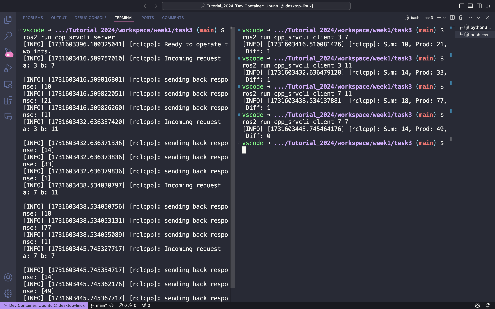

# 任务清单

## 目录
- [Week1](#week1)
- [Week2](#week2)
- [Week3](#week3)
- [Week4](#week4)

## Week1

### WorkLists
- [x] task1 斐波那契数列
- [x] task2 $\rm LinuxShell$
    实现了简单的`book.sh`
- [x] task3 $\rm Ros$ 通信机制
  - [x] 简单话题通信和自定义消息
  - [x] 简单服务通信

### 实现方式

#### task1 斐波那契数列

矩阵快速幂加速递推，复杂度 $O(\log n)$。

使用 `CMake` 编译。

#### task2 LinuxShell

运用了 `grep`, `cat`, `cut`, 以及 `if` 等命令实现了简单的图书查找脚本。

详见 `wrokspace/week1/task2/book.sh` 。

#### task3 ROS通信

编译环境 ( docker )：`Ubuntu 24.04 LTS`

##### Publisher & Subscriber

通过 `Ros2`, `C++` 编写了单个发布节点到单个订阅节点的 `package`。

##### Server & Client

通过 `Ros2`, `C++` 编写了服务器客户端交互 `package`。

其中，使用了自己编写的接口包 `my_interfaces`。

效果图：

