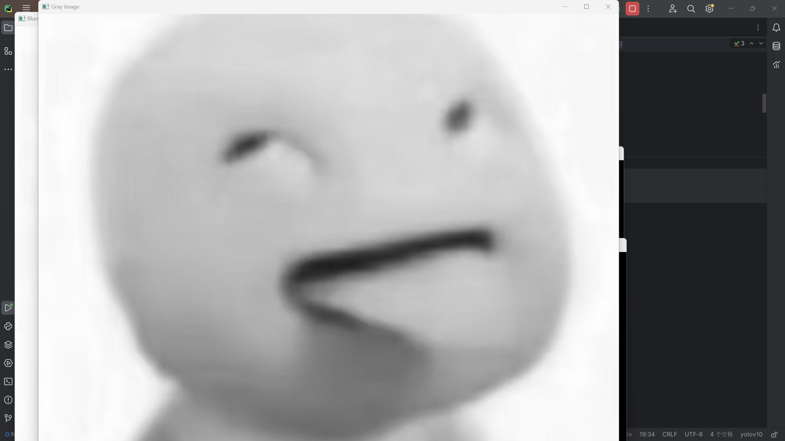

### 基础

#### 安装 OpenCV 并使用基本操作处理图片

原图


灰度


腐蚀


#### 调用 OpenCV 已有的库实现人脸识别


```python
import cv2  
  
face_cascade = cv2.CascadeClassifier(cv2.data.haarcascades + "haarcascade_frontalface_default.xml")  
image_path = r"C:\Users\beyou\Desktop\NEW\b.png" img = cv2.imread(image_path)  
gray_img = cv2.cvtColor(img, cv2.COLOR_BGR2GRAY)  
faces = face_cascade.detectMultiScale(gray_img, scaleFactor=1.1, minNeighbors=5, minSize=(30, 30))  
for (x, y, w, h) in faces:  
    cv2.rectangle(img, (x, y), (x+w, y+h), (0, 255, 0), 2)  
cv2.imshow("Detected Faces", img)  
cv2.waitKey(0)  
cv2.destroyAllWindows()
```

#### 配置 python 和 Anaconda 环境


#### 部署 YOLOv5 模型，成功检测图片测例

加分项已完成

### 加分项

#### 用 coco 数据集训练自己的 yolov5 模型后，再次检测给出图片，对比训练前后检测精度。

	原图


	yolov5s.pt识别结果


	COCO数据集训练后测试结果


#### 使用摄像头视频流作为 yolov5 模型的输入，实现实时检测

