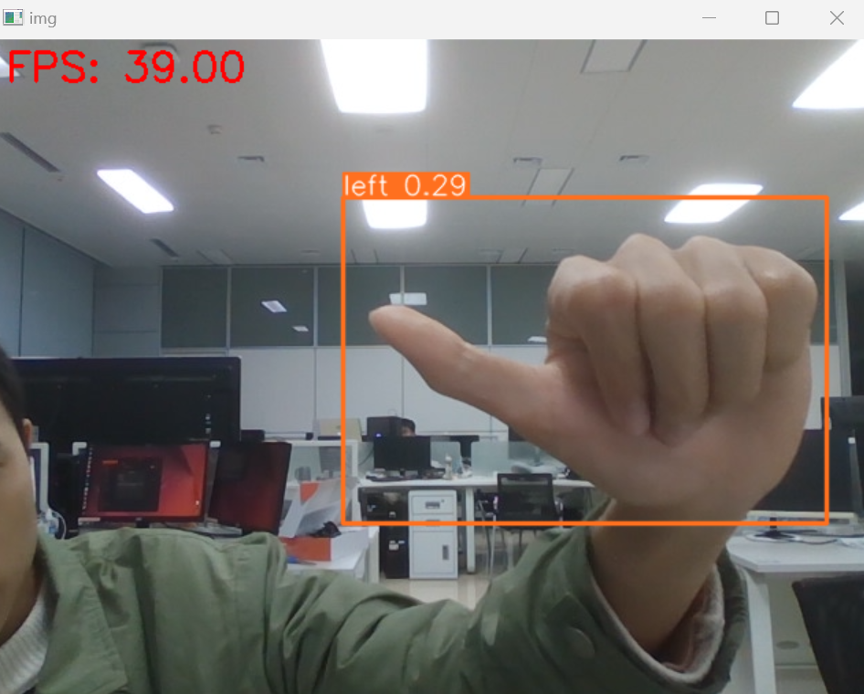
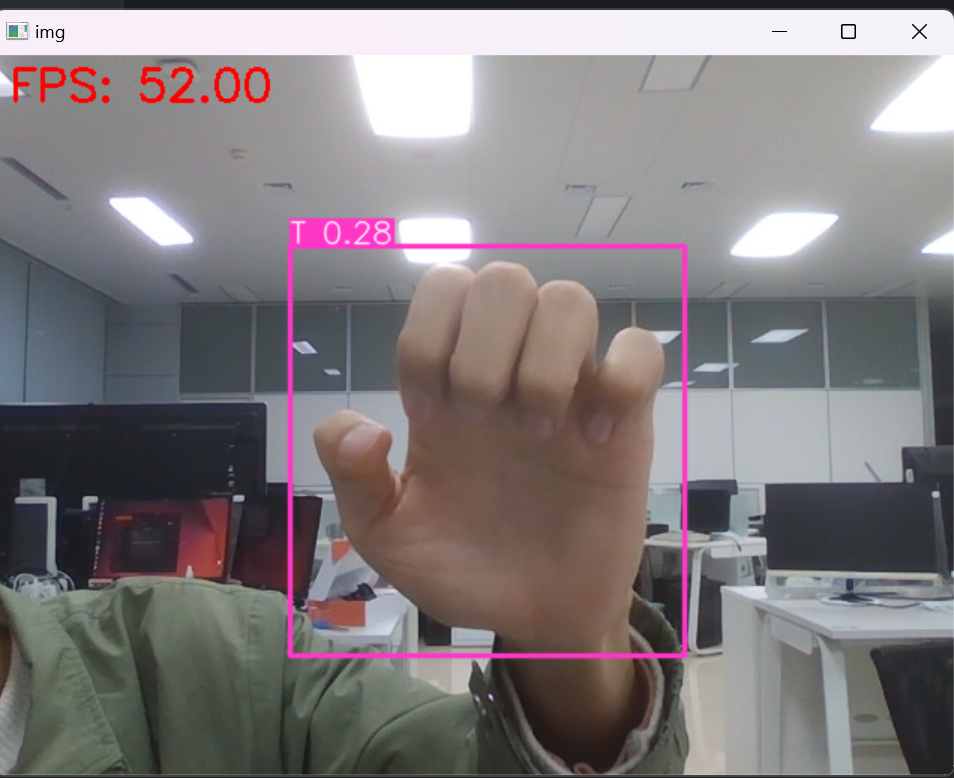

## 能够使用我们给出的权重对上述五种手势进行推理

![[Pasted image 20241206225000.png]](./images/Pasted image 20241206225000.png)

## 自己拍摄数据集进行标注并训练模型（附加）

训练26种英文字母手势

![[Pasted image 20241206221108.png]](./images/Pasted image 20241206221108.png)

## 使用我们的数据集训练一个模型

使用labelimg如下，正常标注即可

![[Pasted image 20241206225316.png]](./images/Pasted image 20241206225316.png)

训练 python train.py --data ./dataset/config.yaml --epochs 300 --batch-size 64

![[Pasted image 20241206225820.png]](./images/Pasted image 20241206225820.png)

结果

![[Pasted image 20241206224444.png]](./images/Pasted image 20241206224444.png)

![[Pasted image 20241206224602.png]](./images/Pasted image 20241206224602.png)

## 关于对本项目的理解

本项目旨在通过手势控制小车，涵盖了神经网络模型的训练过程、数据集制作、ROS控制系统的应用等多个技术领域。首先，用户需要学习如何训练神经网络模型，尤其是YOLOv5模型，用于图像分类任务。本项目中，我们使用YOLOv5模型来识别五种不同的手势，并使用该模型进行图像推理，帮助用户理解神经网络的训练流程，包括数据集的准备、模型训练、权重保存和加载等关键步骤。通过这些过程，用户不仅能掌握如何构建和训练一个神经网络，还能了解目标检测模型在实际应用中的细节。接下来，用户需要制作自己的数据集并进行标注，确保数据集的多样性和代表性，从而提高模型的鲁棒性。标注工具如LabelImg可以帮助用户精确地标定图像中的目标，在数据集的准备阶段尤其重要。与此同时，用户还将学习如何使用ROS中的launch文件启动系统，以及如何配置URDF文件来建模小车，熟悉ROS的开发和调试环境。项目的关键部分是将手势识别与ROS系统中的小车控制相结合，用户需通过编写ROS话题，将YOLOv5识别出的手势信息传递给小车系统。小车订阅该话题后，可以根据收到的控制信号执行相应动作，例如前进、转弯或停止等。通过完成这些任务，用户不仅能够理解和应用深度学习和计算机视觉技术，还能将这些技术与机器人控制系统相结合，真正实现通过手势控制机器人的功能。整个项目的学习过程将帮助用户更好地掌握深度学习、机器人控制、ROS系统开发等核心技术，为今后的研究和项目开发奠定坚实的基础。