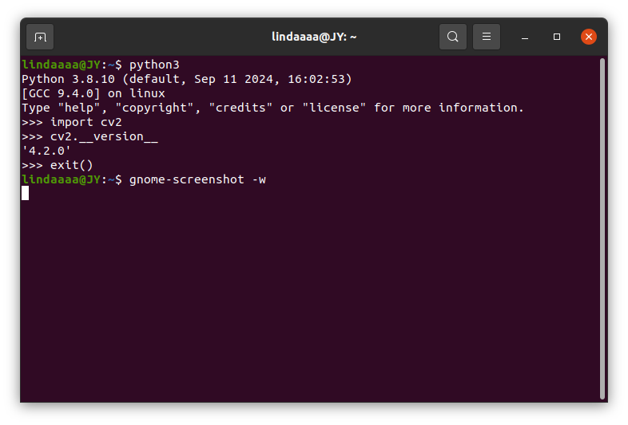
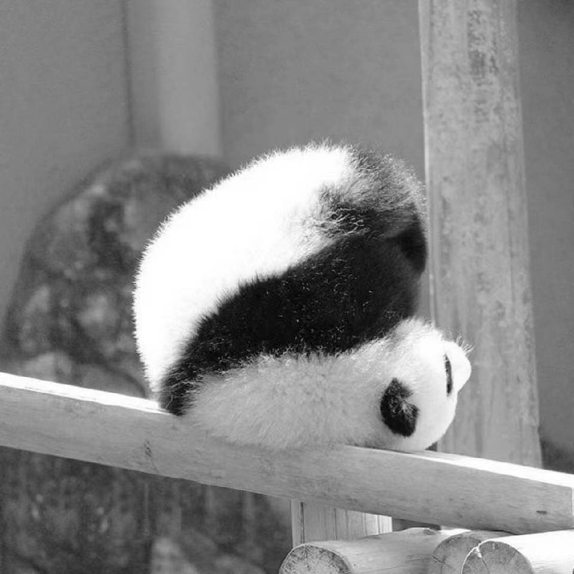
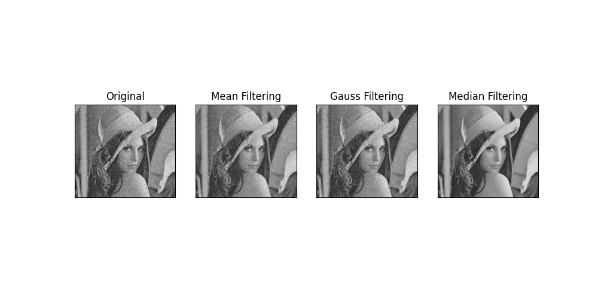
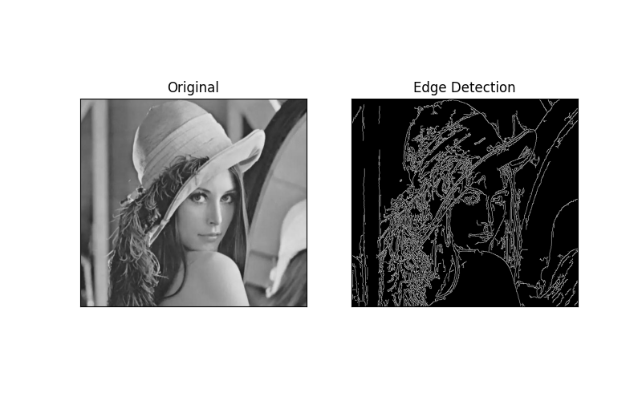
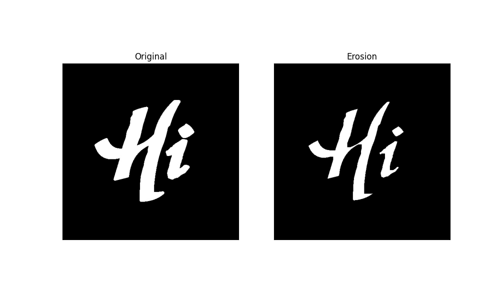
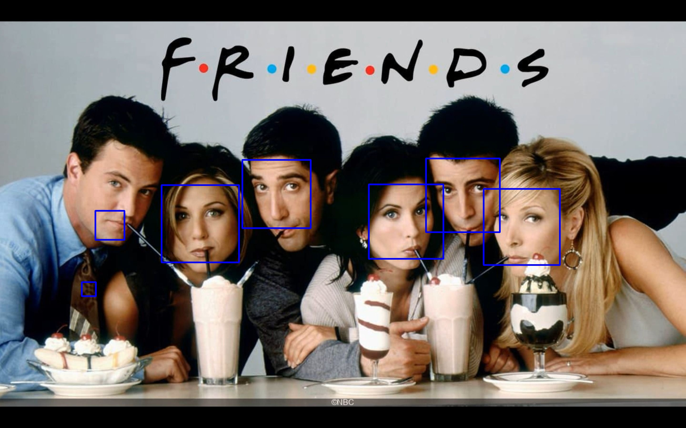
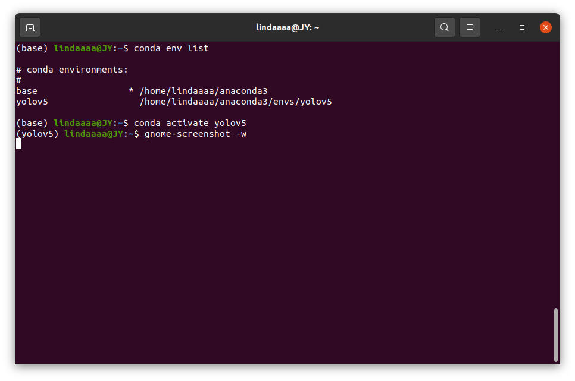
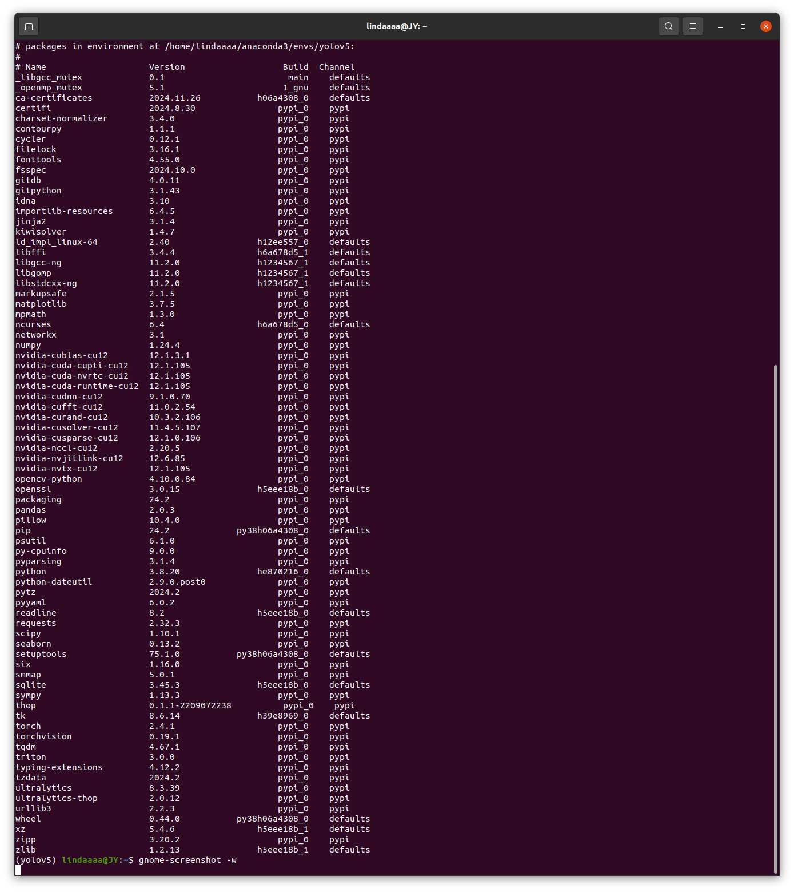
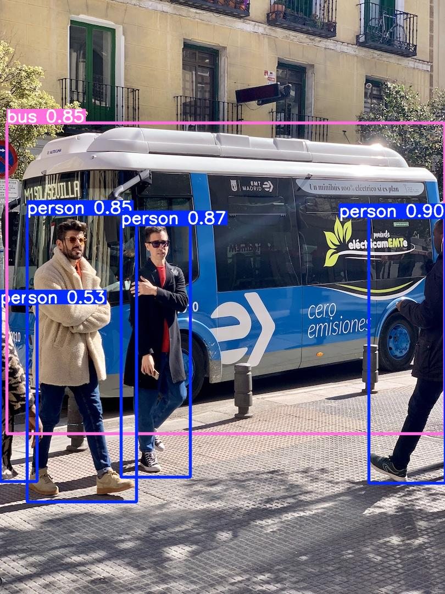

# 完成情况
- 【完成】下载opencv

- 【完成】熟悉OpenCV并能够简单调用OpenCV的API来处理图像

- 【完成】配置 Python 环境，学会使用 Anaconda 来管理环境。

- 【完成】在Ubuntu中部署运行 YOLOv5 模型

ps.很抱歉很抱歉，上周交的时候完全没看到workspace文件夹，所以task1传到task路径下面去了，刚发现了赶紧全部移回来了

## 1 opencv安装
下载
```shell
# 安装 Python 3 接口
sudo apt install python3-opencv
# 安装 c++ 接口
sudo apt install libopencv-dev
```
验证python版安装


验证+++安装，编写一个简单的程序 `display_image.cpp`

```cpp
#include <iostream>
// OpenCV library headers
#include <opencv2/opencv.hpp>
#include <iostream>

int main() {
    cv::Mat image = cv::imread("picture.png", cv::IMREAD_COLOR);
    if (image.empty()) {
        std::cout << "Could not open or find the image" << std::endl;
        return -1;
    }
    cv::namedWindow("Display window", cv::WINDOW_AUTOSIZE);
    cv::imshow("Display window", image);
    cv::waitKey(0); // Wait for a keystroke in the window
    return 0;
}
```
编译

```shell
g++ display_image.cpp -o display_image `pkg-config --cflags --libs opencv4`
```
ps.新安装的版本头文件要写opencv2

编译成功后运行查看效果（左侧是打开的图片）

```shell
./display_image
```


## 2调用OpenCV的API来处理图像

### 2.1 利用 OpenCV 对任意一张图片进行灰度化、高斯模糊、边缘检测、膨胀、腐蚀 等基础处理操作。
#### 灰度化(/pythons_cripts/图像修改. py)
```python
import cv2

image=cv2.imread("data/opencv/a.jpg")
# ===================================================

# ==================一些属性===========================
print(image.shape)  # 图像的形状(H行数,W列数,C):(960, 960, 3)
                    ## 如果是二值图像或者灰度图像，则仅返回行数和列数
print(image.size)   # 像素数目 H*W*C:2764800
print(image.dtype)  # 图像的数据类型:uint8
# ===================================================

# ====================颜色空间转换=====================
img=cv2.cvtColor(image,cv2.COLOR_BGR2GRAY)
cv2.imwrite("./runs/opencv/edit_image.jpg",img)
# 主要是RGB,BGR,GRAY,HSV,LAB,YCrCb
## cv2.COLOR_BGR2GRAY
## cv2.COLOR_HSV2BGR
## cv2.COLOR_GRAY2RGB
## cv2.COLOR_BGR2LAB
## cv2.COLOR_BGR2YCrCb
# ===================================================
```


#### 高斯模糊(/pythons_cripts/图像平滑、去噪. py)
```python

import cv2
import numpy as np
import matplotlib.pyplot as plt

# 图像读取
img = cv2.imread('data/opencv/noise.jpg')

# 图像平滑
# ## 均值滤波cv2.blur(输入图像, 卷积核的大小)
# ## 高斯滤波cv2.GaussianBlur(输入图像, 卷积核的大小, 水平方向的高斯核标准偏差, 垂直方向的高斯核标准偏差, 边界的填充类型)
# ## 中值滤波cv2.medianBlur(输入图像, 卷积核的大小)
blur1 = cv2.blur(img, (5, 5))   # 均值滤波
blur2 = cv2.GaussianBlur(img, (5, 5), 1)    # 高斯滤波
blur3 = cv2.medianBlur(img, 5)  # 中值滤波

# 图像显示
# ## plt.figure创建了一个图形窗口，大小为10x5英寸，分辨率为100（DPI）
# ## 使用plt.subplot(nrows, ncols, index)来创建子图
# ## plt.subplot(141)表示创建一个1行4列的子图网格，并激活第一个子图
# ## 分别显示原始图像和三种滤波后的图像
# ## plt.imshow用于显示图像，plt.title用于设置子图的标题
# ## plt.xticks([])和plt.yticks([])用于移除x轴和y轴的刻度标签
plt.figure(figsize=(10, 5), dpi=100)
plt.rcParams['axes.unicode_minus'] = False     # 确保在图中显示负号时不会出现方块或乱码
plt.subplot(141), plt.imshow(img), plt.title("Original")
plt.xticks([]), plt.yticks([])
plt.subplot(142), plt.imshow(blur1), plt.title("Mean Filtering")
plt.xticks([]), plt.yticks([])
plt.subplot(143), plt.imshow(blur2), plt.title("Gauss Filtering")
plt.xticks([]), plt.yticks([])
plt.subplot(144), plt.imshow(blur3), plt.title("Median Filtering")
plt.xticks([]), plt.yticks([])

plt.savefig('./runs/opencv/denoise_image.png')
plt.show()
```
 
#### 边缘检测(/pythons_cripts/边缘检测. py)
```
import cv2
import numpy as np
import matplotlib.pyplot as plt

# 图像读取
img = cv2.imread('data/opencv/luna.jpg')

# Canny边缘检测：去除噪声(高斯滤波)-计算图像梯度(Sobel滤波器)-非极大值抑制-滞后阈值(2个)
lowThreshold = 1
max_lowThreshold = 80
canny = cv2.Canny(img, lowThreshold, max_lowThreshold)

# 图像展示
plt.figure(figsize=(8, 5), dpi=100)
plt.rcParams['axes.unicode_minus'] = False
plt.subplot(121), plt.imshow(img, cmap=plt.cm.gray), plt.title("Original")
plt.xticks([]), plt.yticks([])
plt.subplot(122), plt.imshow(canny, cmap=plt.cm.gray), plt.title("Edge Detection")
plt.xticks([]), plt.yticks([])

plt.savefig('./runs/opencv/detect_image.png')
plt.show()

```

 

#### 膨胀腐蚀(/pythons_cripts/膨胀腐蚀. py)
```python
import cv2
import numpy as np
import matplotlib.pyplot as plt

# 图像读取
img_org = cv2.imread('data/opencv/example_org.jpg')
img_noise = cv2.imread('data/opencv/example_noise.jpg')

# 创建核结构np.ones(shape,dtpye=None,order='C)
kernel = np.ones((10, 10), np.uint8)  # 10*10的全1矩阵

erosion_img = cv2.erode(img_org, kernel)  # 腐蚀  (输入图像, kernel, 迭代次数iteration)
dilate_img = cv2.dilate(img_org, kernel)  # 膨胀
# (输入图像,操作类型,kernel核大小)

# 图像显示
# matplotlib.pyplot.figure(画像编号或名称, figsize画像的宽和高, dpi像素数, facecolor背景颜色, edgecolor边框颜色, frameon是否绘制画像, FigureClas选用的自定义Figure, clear是否清除原有画像)
plt.figure(figsize=(10,6), dpi=100)
plt.rcParams['axes.unicode_minus'] = False

plt.subplot(121), plt.imshow(img_org), plt.title("Original")
plt.xticks([]), plt.yticks([])  # 不显示坐标轴
plt.subplot(122), plt.imshow(erosion_img), plt.title("Erosion")
plt.xticks([]), plt.yticks([])

plt.savefig('./runs/opencv/derodila_image.png')
plt.show()

```

### 2.2 调用 OpenCV 已有的库实现人脸识别
```python
import cv2

# 加载预训练的人脸检测模型
face_cascade = cv2.CascadeClassifier(cv2.data.haarcascades + 'haarcascade_frontalface_default.xml')

image = cv2.imread('data/opencv/friends.jpg')
gray_image = cv2.cvtColor(image, cv2.COLOR_BGR2GRAY)

# 检测人脸
faces = face_cascade.detectMultiScale(gray_image, scaleFactor=1.1, minNeighbors=5, minSize=(30, 30))

# 绘制矩形框
for (x, y, w, h) in faces:
    cv2.rectangle(image, (x, y), (x+w, y+h), (255, 0, 0), 5)

cv2.imwrite("runs/opencv/friends.jpg",image)
cv2.imshow('Face Detection', image)
cv2.waitKey(0)
cv2.destroyAllWindows()
```

## 3 安装anaconda、pycharm、配yolov5环境
anaconda和pycharm已经安装好，下载好yolov5的包。
```
# 下载yolov5的包
git clone https://github.com/ultralytics/yolov5
cd yolov5
```
下面展示配好的环境
```
# 配环境所用的代码(换源)
pip install -i https://pypi.tuna.tsinghua.edu.cn/simple -r requirements.txt
```
 



## 4 在Ubuntu中部署运行 YOLOv5 模型
在pycharm中，yolov5环境下，运行/pythons_cripts/detect.py文件，实现对单张图片预测。
```python
import torch

# Model
model = torch.hub.load("ultralytics/yolov5", "yolov5s")  # or yolov5n - yolov5x6, custom

# Images
img = "data/images/zidane.jpg"  # or file, Path, PIL, OpenCV, numpy, list

# Inference
results = model(img)

# Results
results.show() 
```


