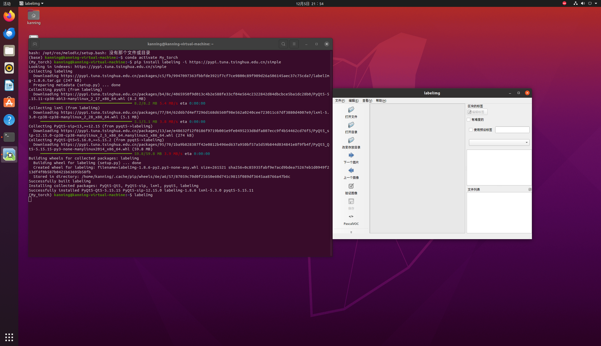
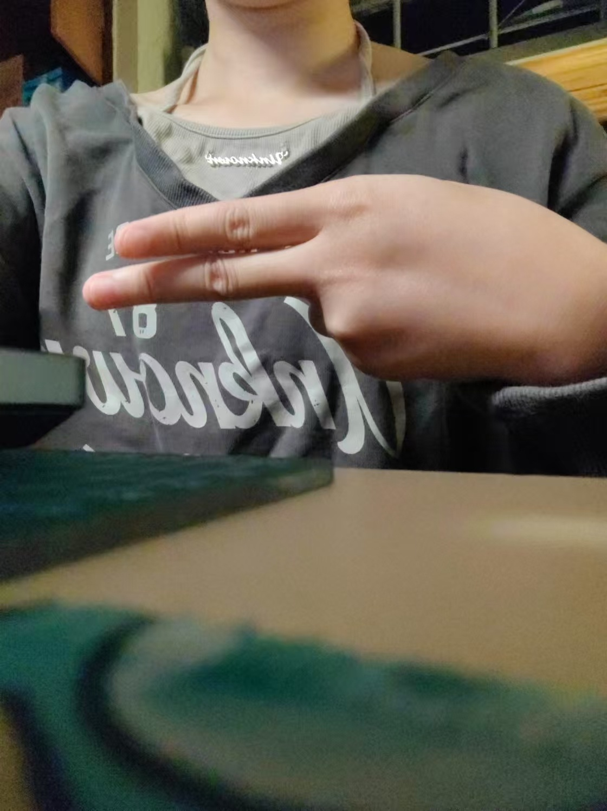
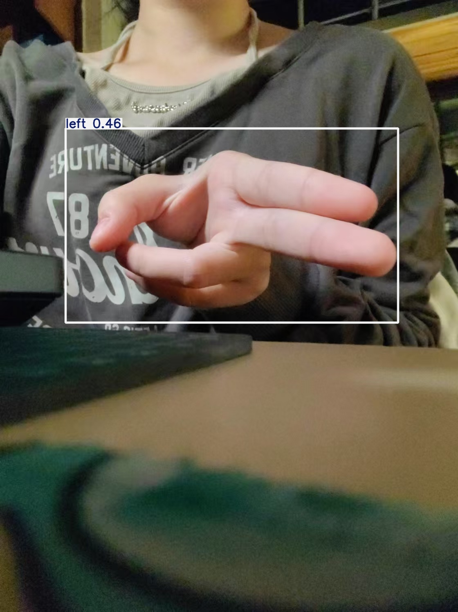
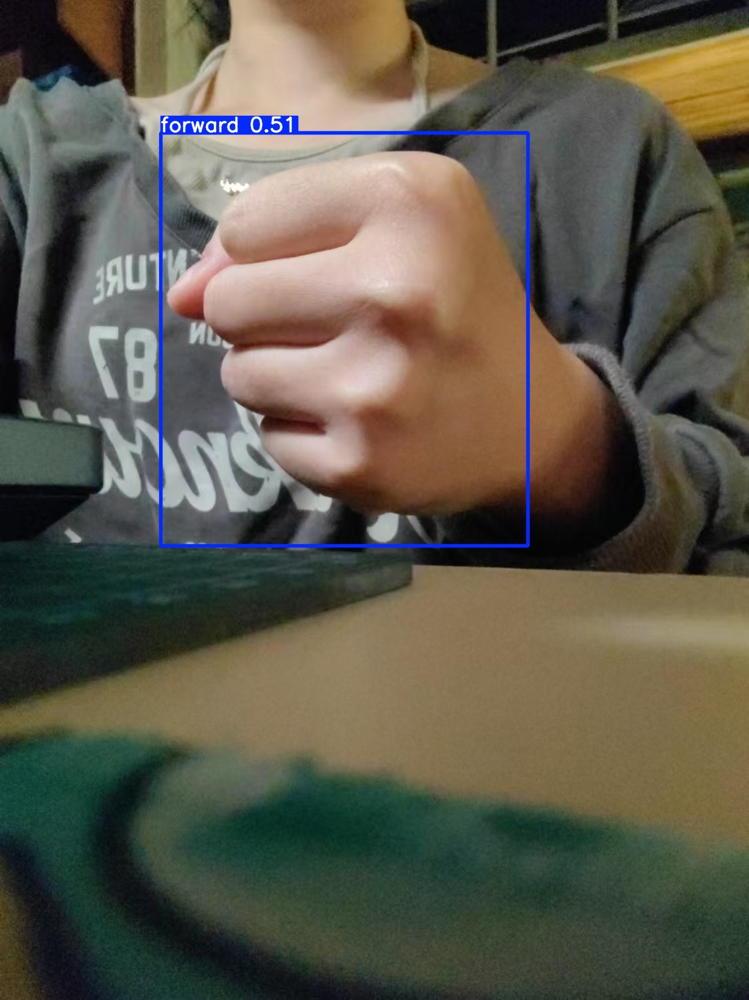
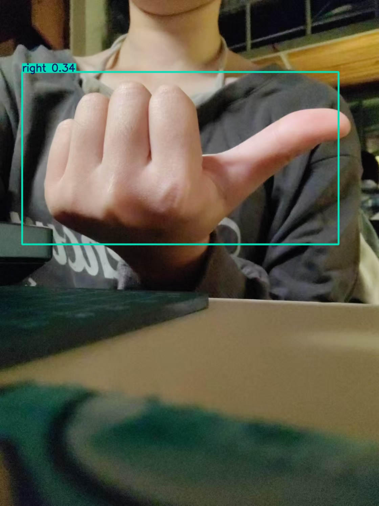
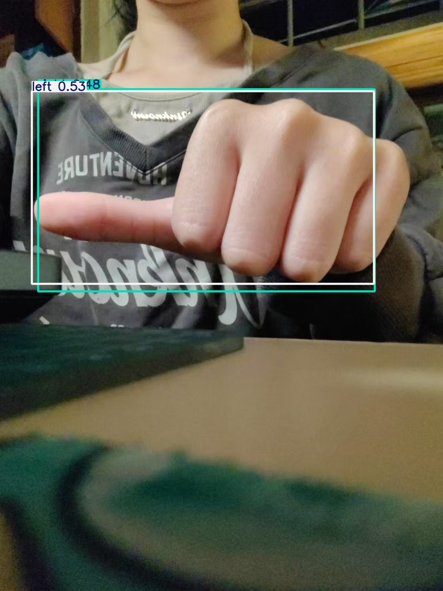
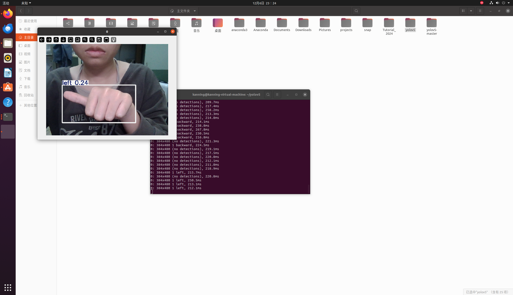
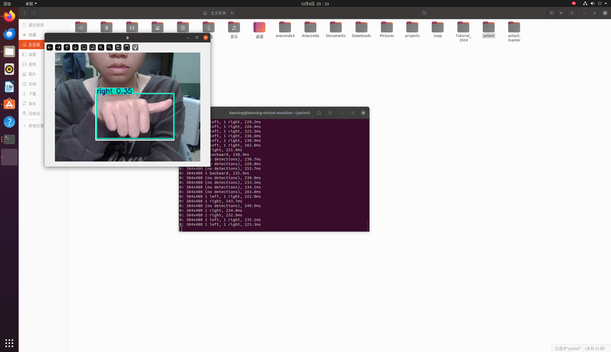
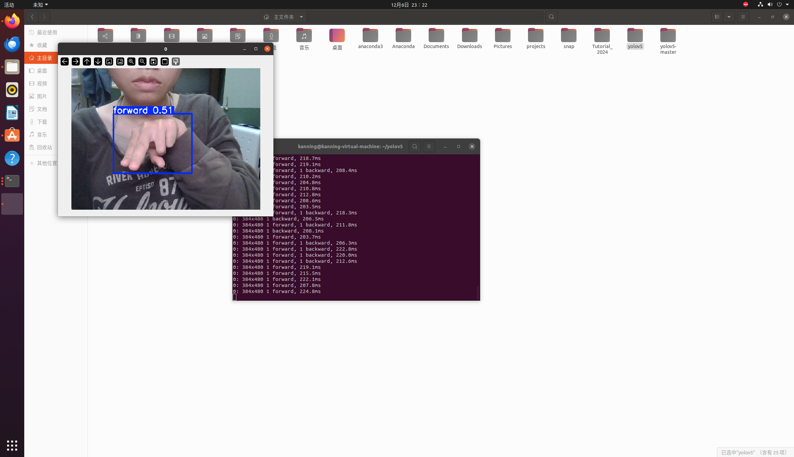
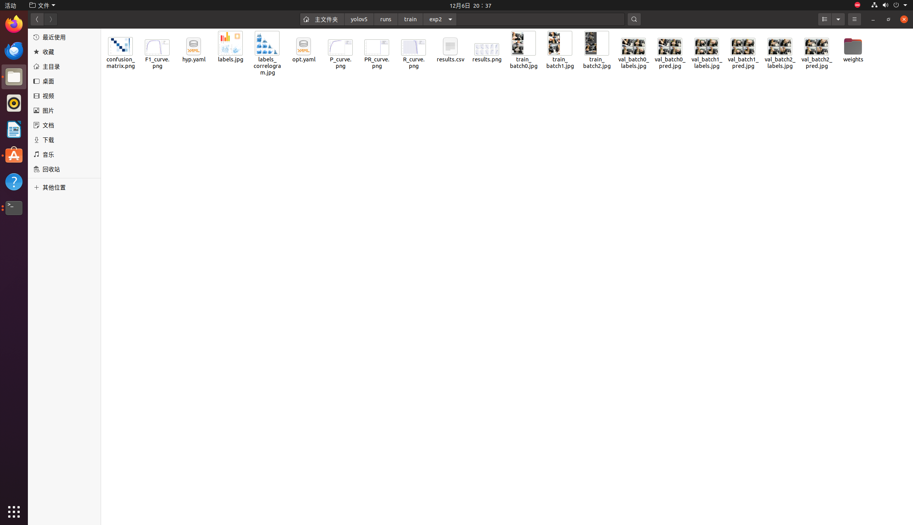

author: Kanning666
date: 2024.12.6
# 1.安装labelimg


# 2.预测图片
### 先训练原先给出的图片
- 由于电脑是CPU模式，所以训练时调小了一下批量和图片大小
```
python train.py --data config.yaml --epochs 40 --batch-size 2 --img-size 320 --workers 1
```
### 再预测自己拍摄的图片
- 所以训练结果可能不太完整，以致于放入我自己模仿拍摄的手势图片后，预测后结果有些不太准确。运行以下命令检测：
```
python detect.py --weights runs/train/exp2/weights/best.pt --img-size 480 --conf-thres 0.2 --source My_detect --device cpu
```
### 预测结果






# 3.摄像头
- 运行摄像头命令
```
python detect.py --weights runs/train/exp2/weights/best.pt --img-size 480 --conf-thres 0.2 --source 0 --device cpu
```
- 截图示例






# 4.用给出数据集训练权重
- 见第二点，预测前已经训练了，训练结果见`exp2`文件夹


# 5.录制自己的个性手势
1. **将自己的手势图片放入新建的`My_dataset`文件夹中，用`labelImg`打好标签（标签存放在My_dataset/label中）**
2. **创建`config.yaml`**
```
path: /home/kanning/yolov5/My_dataset  # 数据集根目录
train: train.txt        # 训练图片的路径
val: val.txt            # 验证图片的路径


names:
  0: yes
```

3. **在`My_dataset`文件夹里创建`process_data.py`,运行**
```
python process_data.py
```
4. **运行训练命令**
```
python train.py --data ./My_dataset/config.yaml --epochs 10 --batch-size 2 --img-size 320 --workers 1
```
5. **在runs/train得到`exp4`文件夹，里面包含训练结果**


ps:没有完成小车部分

