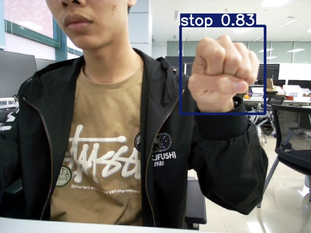

# Week3
## 1 使用给出的权重对上述五种手势进行推理
### 1.1图片预测
把待测试图片放在/data/images文件下
运行
```
python detect.py --weights /home/lindaaaa/下载/Tutorial_2024/tasks/week3/视觉组/source/exp6/weights/best.pt
```
得到结果在output/task1下

### 1.2打开摄像头实时预测
运行
```
python detect.py --weights tasks/week3/视觉组/source/exp6/weights/best.pt --source 0
```
得到结果在output/task2下

## 2 使用数据集训练一个模型
首先运行process_data.py
```python
python process_data.py
```
然后修改config.yaml内容为
```
path: ./data/dataset # dataset root dir
train: train.txt # train images (relative to 'path') 118287 images
val: test.txt # val images (relative to 'path') 5000 images
test: val.txt # 20288 of 40670 images, submit to https://competitions.codalab.org/competitions/20794

# Classes
names:
  0: forward
  1: backward
  2: left
  3: right
  4: stop
```
把dataset文件移动到/yolov5/data路径下，把dataset里的yaml文件移动到/yolov5/data路径下。即
```
-yolov5
--data
---dataset
----train
----test
----val
----train.txt
----test.txt
----val.txt
---config.yaml
```
然后可以开始训练
```python
python train.py --data config.yaml
```
训练的参数、结果在output/task3文件中。(由于时间问题 训练到86就结束了)